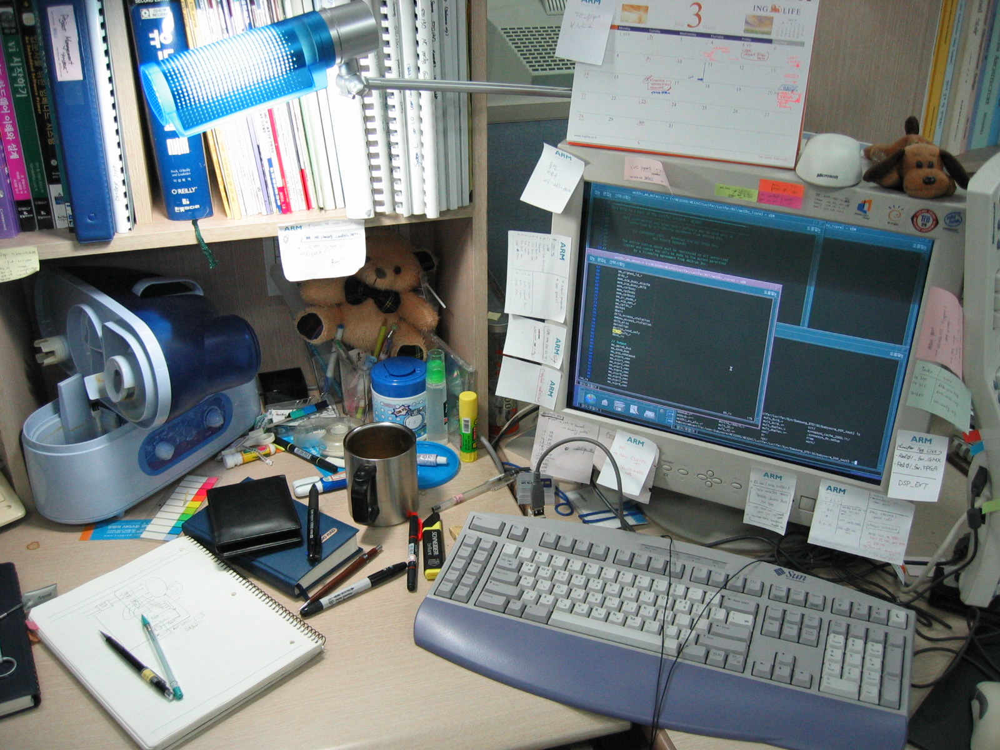

2004년 3월 3일&#8230; 프로젝트로 한창 바쁘고, 한창 머리 아프고..&nbsp;
웍은 미친듯이 돌아가고, 밤은 깊어가고.. 집에는 못가고..

정리안된 모듈의 인터페이스들마냥 &nbsp;정리안된 책상.. 덕지덕지 붙어있는 포스트잇&#8230; 식어버린 커피..

2004년 3월 3일 밤 10시 10분.

지금은 회사도 이사했고, 개인 PC도 바뀌었고.. 가습기도, 스탠드도 바뀌었군요..

하지만, 그 당시와 같은 웍, 같은 책상..
여전히 계속되는 아키텍쳐 설계, 모듈 설계 검증&#8230;

과연 2년이라는 시간이 저를 더 키워주었는지 모르곘습니다.
나태해지지 말아야겠습니다.
