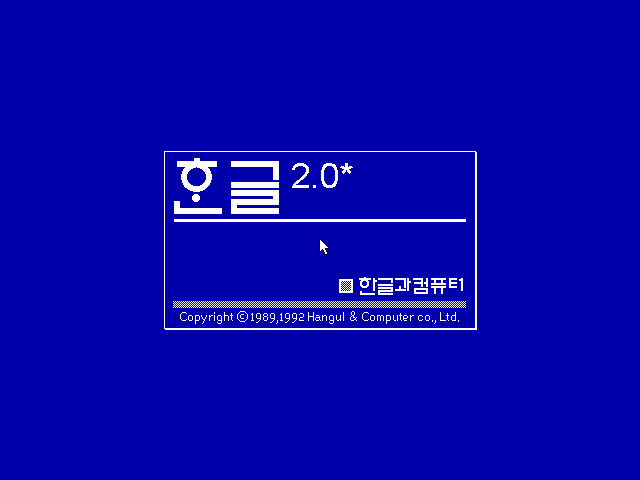
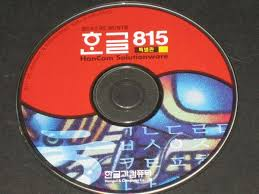

아래아 한글을 안써본 사람이 있을까?
 
아래아 한글이란 것을 91년부터 쓰기 시작했으니, 정말 오래되었다.
 
하지만, 한글 2.0을 어린나이에 학생할인이 된다는 알량한 이유로 세뱃돈을 탈탈털어 샀던 나로서는 너무나 실망했고, 정품과 불법소프트웨어간의 아무런 차이를 느낄수도 없었으며.. (안된다고 전화해서 물어보면 아주 즐거운 취급을 받았었다..) 그 이후로 아래아 한글을 사지 않으리라 결심도 했었다.
 
그러던 어느날 아래아 한글이 망한다고, 어쩌구 하면서 815버젼을 사게 되었고 잘 사용했던것 같다..

나름대로 오래된 아래아 한글 사용자인지라, 키보드 매크로는 대부분 알고 있는데, 간혹 매크로가 바뀔때마다 배신감도 느끼고.. ^^;

여하튼.. 어느 순간 부터인가 버그 투성이 아래아 한글을 안쓰게 되었다.
 
어느 순간 부터 아래아한글의 불친절함이나 다른 툴과의 비교가 되기 시작했고..
 
회사 오면서는 회사에서 구매한 아래아 한글가 몇카피 안되어 안쓰게 되었다.
(뭐 정품 워드가 깔려 있지만, 지금이 이것도 많이 쓰지 않는다.. 거의 LaTeX을 쓰는지라..)

관공서나 이런곳에는 아직도 많은 곳에서 &#8220;국산&#8221;이라는 이유로 아래아 한글로 문서를 작성해야 하고, 아래아 한글 문서를 생산해낸다.. 좋은 방침이라고 생각한다.

하지만, 아래아 한글 문서를 보기 위한 방법인 무료 프로그램인 HWPviewer는 어떠한가?

한마디로 &#8220;이보다 더 나쁠 수 없다&#8221;

HWPviewer 2002버젼은 상위 버젼 문서라고 난리친다.&nbsp; 뭐 이해한다.. 세상이 변했으니..
 
HWPviewer 2005는 어떠한가?
 
내가 처음받은 HWP viewer 2005(한컴 홈페이지에 있는)는 윈도우 상에서 화일 연결이 불가능한 아주 생각없이 만든 프로그램이다. (즉, 문서를 열기 위해서 해당 문서를 더블클릭하는 방법은 안되고,&nbsp; 프로그램 띄우면 자동으로 뜨는 문서 열기를 통하여 문서를 열어야 한다.. 이게 뭐냐?)

그래서, 업데이트가 되었나보다.. HWP viewer 2005 6.7.5.978 버젼.. (한컴 홈에는 아직도 예전 버젼이 있지만..)
 
이제 문서 연결은 된다. 그런데, 더블클릭해서 문서를 열면 해당 문서가 열리는 건 좋은데, 프로그램이 수행되면서 자동으로 문서 열기 창이 띄고 하나의 문서를 추가적으로 더 열어야만 한다. (취소를 선택하면 프로그램이 종료된다)

그래, HWP viewer는 무료 프로그램이다.
 
고객지원 안하는 거 당연하다고 생각한다.
 
하지만, 생각은 하고 프로그램 만드시나? 노력했다고? 사용자의 입장에서 사용 한번만 해봤으면 이런 오류는 발생하지 않는다.

한컴에 계신 프로그래머 분들께서 낙심할까봐 차마 더 심한말은 못쓰겠지만&#8230;
 
아래아 한글이 점점 더 멀어지는 것은 마이크로소프트의 저가 공세가 아니라, 아래아 한글의 견고성이 떨어지기 때문이다.
 
아래아 한글이 과연 기능에 충실한가?
