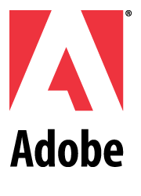

Adobe 사의 국내 법률 대행하는 곳에서 회사로 연락이 왔다. &#8220;**불법 소프트웨어 사용을 중단해라. 그렇지 않음 고소하겠다**&#8221;

우리회사는 블로그상에서 몇번 쓴 적이 있지만, 반도체 설계하는 회사다. 특히 프로세서 만드는 회사고..

처음엔 뭔가 불법 소프트웨어를 깔고 쓰는 사람이 있나보다하고, 내부적으로 조사했는데&#8230;.불법 사용자는 없었다.
(사실, 회사에서 Adobe쓸일이 거의 없다.Photoshop CS 한카피.. 소프트웨어 팀에서 UI에 넣을 그림 그린다고 하나 있고, Acrobat 이 몇카피.. 외부에 pdf만들어 줄때 쓰는 정도?)

그럼에도 불구하고!

몇일전에 Adobe 법률 대행하는 곳에서 우리 회사로 쳐들어와서 소프트웨어 조사를 했는데, 불법 사용이 없으니 당연히 불법 사용자도 없는 것이 당연하거 아니겠어?

그런데, 그 인간들 회사로 쳐들어온 이유가 웃기지도 않는다.
우리 회사 영문 홈페이지에 processor design, ASIC/SoC design (한글로 하면 프로세서 설계 및 ASIC/SoC 설계)이라고 되어 있는데 (뭐 이전 회사명도 ASIA Design Corp.이었고), design 회사에서 어떻게 Adobe사의 소프트웨어를 사용하지 않을 수 있냐는 거다.

우리회사의 design은 그 design이랑 관계가 없다고 해도 말이 통하지 않는 바보들..
Adobe의 software가 얼마인지 별 관심도 없지만, 한카피에 몇억씩하는 CAD 설계 툴을 쓰는 회사에 와서 별 땡깡을 피우고 가다니..

몇 일 후에 또 온단다. 오던지 말던지..
저런 인간들한테 법률 대행을 맡긴 Adobe가 더 불쌍하지.

여하튼, 코미디야..

불법 사용 프로그램 있는지 확인하느라고, 귀찮게 하는 것만 빼고 말야..
