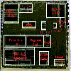
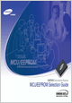
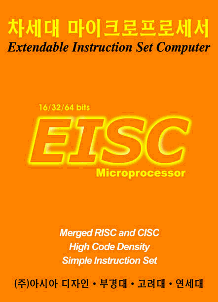
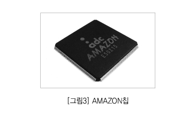
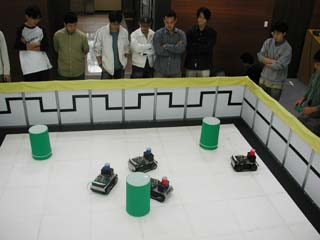

얼마전에 다나와라는 사이트에서 국산 마이크로 프로세서에 대한 이야기가 오고 간적이 있습니다.
이런 저런 이야기가 많이 오고 갔지만, 물끄러미 보고 있자니 사용자들의 국산 프로세서에 대한 열망이 느껴지더군요..

저도 그리 깊이 아는 것은 아니지만, 제가 아는 한도내에서 국산 마이크로 프로세서에 대해서 이야기해 보고자 합니다.

국산 마이크로 프로세서에 대한 연구는 대학 연구실과 국가 연구소들에서 지속적으로 관심의 대상이었습니다만, 상용화 된 경우는 제가 알고 있기로 없습니다.

국내 연구실중에서 상용 수준에 가장 근접했던 곳은 아마도 KAIST에서 수행된 x86 호환칩(펜티엄 호환칩까지 나왔습니다)이 아닌가 생각됩니다. 물론, 이를 후원하던 현대전자가 사라지면서 이 프로젝트는 사실상 사라졌습니다만…

<figure>

<figcaption>
  KAIST 경종민 교수님 연구실에서 개발한 Marcia 프로세서(펜티엄 호환칩)
</figcaption>
</figure>

사실상 데스크탑이나 서버용도의 프로세서에 있어서는 큰 격차가 있는 상태이므로 이를 따라 잡기는 쉽지 않을 것이라 생각됩니다. 게다가, 데스크탑과 서버 시장 모두 x86기반의 아키텍쳐가 거의 통일하고 있는 상태이므로, 다른 아키텍쳐가 나온다해도 이미 강력하게 구축된 소프트웨어 지원을 따라잡기는 어려울 것이라 생각됩니다.

기업체로 눈을 돌렸을때 역시 가장 상용수준에 근접했던 곳은 삼성전자 프로세서 연구실입니다.
삼성-알파라는 프로세서로 세계최초로 1GHz의 벽을 뛰어넘은 프로세서를 만든 곳이죠.
아쉬운 점은 알파라는 기존의 프로세서를 받아서(제가 알기로는 backend까지 끝난.. 즉, 거의 다 설계된 도면이라고 해야 겠지요..), 이를 삼성 공정에 circuit수준에서 최적화시키는 공정을 한것으로 알고 있습니다.
그렇다해도, 이 circuit 이하 수준의 최적화 기술이 매우 어려운 기술이므로 절대로 낮추어 볼만한 일은 아닙니다.
아쉽게 알파 프로세서가 사양길로 접어들면서, 삼성에서도 이 프로젝트를 접게 되었습니다.
이후에 리누스가 있는 것으로 유명한 트랜스메타의 칩에 대한 도입이 검토되었지만 무산되었으며, 서버/데스크탑 시장은 접게 됩니다. 그리고, 눈을 내장형 프로세서로 돌려서 ARM 프로세서 아키텍쳐를 받아서 역시 세계 최고속도의 ARM을 만들고 있습니다. (best cond.에서 1GHz를 넘고 있는 프로세서니 대단합니다.)

이제 국내 기술만으로 만들어진 자체 프로세서에 대한 이야기를 해봅시다.

우선, 잠시 프로세서에 대한 이야기를 하겠습니다.
프로세서라는 것은 프로세서 기술이라는 것이 한 20%정도 밖에 차지하지 않습니다. 광범위한 컴파일러 기술, OS 기술, 시스템 프로그래밍 기술.. 이런 것이 필요하죠..

프로세서가 높은 성능을 발휘한다는 것은 이러한 모든 것이 집결되었을때 가능한 것입니다.
그런데, 아쉽게도 국내에는 컴파일러, OS, 시스템 프로그래밍이라는 분야가 아주 취약합니다.
삼성과 같이 능력있는 기업에서 자체 아키텍쳐를 개발한 적이 있으나, 이를 사장시키고 ARM 기반의 프로세서를 채택한 것도 바로 이미 구축되어 있는 ARM의 강력한 인프라를 사용할 수 있다는 장점때문입니다.
한마디로, 프로세서를 만드는 것보다 프로세서를 제대로 운용하는데 필요한 프로그램을 얻기가 더 어렵다.. 그래서, 되도록이면 기존의 것을 쓰려고 한다..  이것입니다.

하지만, 이는 여러 소프트웨어의 강력한 지원이 필요한 시장에서의 이야기이고, 소프트웨어의 호환성이라던지 지원에 대한 의미가 약간 적은 내장형 프로세서 시장에서는 여러가지 의미 있는 시도들이 존재했는데..(아직도 존재합니다요..)

가장 큰 것이 System IC 2010과제(시스템 IC를 2010년까지 선진국 수준으로 끌어올리자는 대형 국책 프로젝트입니다.)에서 두개의 의미 있는 프로세서가 개발되었다는 점입니다.

<figure>
  

  <figurecaption>
    CalmRISC 이미지 컷[삼성전자]
  </figurecaption>
</figure>

첫번째는 삼성의 calmRISC입니다. 지금은 조용히 사장되었습니다만, 삼성 특유의 공격적인 투자로 좋은 출발을 했었습니다. 삼성 전자 공정 특유의 저전력 소모라던지.. 몇몇 연구실과 연계해서 캐쉬 구조나 컴파일러, OS모두 좋은 방향으로 가고 있었습니다만.. 너무 특색없는 RISC였던것이 문제였던것 같습니다.

개발환경도 너무 과하게 큰 BDM기반의 기술을 채택했구요..
현재는 이름만 남아 있는듯 합니다만, 빨리 되살아나길 바랍니다.

두번째는 ADChips의 EISC 프로세서입니다. 현재 제가 만들고 있는 CPU이기도 합니다. RISC기반의 프로세서인데 CISC적인 요소가 많은 유별난 아키텍쳐를 가지고 있으며, 그래서 EISC라고 이름 붙여진 프로세서입니다. system IC 2010에서 삼성 calmRISC와 경쟁 과제로 선정되어 최종적으로 과제에서 더 높은 평점을 받으며 아주 좋은 출발을 했습니다.
(아마도, 조금 더 큰 기업에서 공격적인 투자를 진행했다면 EISC의 현재 모습은 좀 더 다른 모습이 아닐까 생각됩니다.. 아쉽기는 하지만, 현재의 EISC의 모습이 이정도되는 것도 중소기업으로 하기 힘든 투자를 계속하고 있는 회사 결단의 산물이겠습니다.)

<figure>

<figurecaption>
SystemIC 2010 첫 성과 발표회때 썼던 EISC 프로세서 Flag.
</figurecaption>
</figure>

<figure>
  

  <figurecaption>
    EISC가 탑재된 그래픽 프로세서, 게임기에서 많이 사용됩니다.
  </figurecaption>
</figure>

현재도 EISC 프로세서는 지속적으로 개발과정에 있고, 여러 대학과의 연계를 통해서 컴파일러도 재 정비되고 있습니다. uCLinux가 포팅되어 현재 사용가능하고, Linux포팅도 곧 될 예정이지요.
현재 SoC Robotwar[1]에서 메인 프로세서로 사용중입니다. 

<figure>
  

  <figurecaption>
    SoC 로봇워 경기장면, 원통의 색이나, 벽의 패턴을 인식해서 공격이나 동작을 선택합니다.
  </figurecaption>
</figure>

그 이외에 국내에서의 프로세서들중에서 눈길을 끄는 부분은 8051기반의 프로세서들이 아직도 잘 팔리고 있다는 점이고, 이를 이용해서 돈을 벌고 있는 회사가 있다는 점입니다. 개발자들은 아무래도 익숙한 것을 계속 고집하는 경향이 있지요.. 하지만, 그 이상으로 8051의 저력이 무섭습니다.

위에 이야기 한것 처럼 국산 프로세서가 전무한것은 아닙니다.
단, 외산 프로세서 아키텍쳐에 국산 기술을 입혀서 만들고 있는 경우가 대부분이라 잘 인식하지 못할 뿐이지요(ARM을 이용한 삼성-ARM, 8051기반의 프로세서들).
국산 기술만의 프로세서의 경우 아직 시장에서 크게 두각을 나타내지 못하고 있다는 점도 있구요 (EISC).
대학과 국책 연구실에서는 오늘도 수많은 시도가 있을것입니다. 아직 일반인의 눈에 보이지 않을뿐이지요.

제가 만들고 있는 EISC의 경우만 이야기하자면,
EISC의 경우 그 개발 키트가 공개되어 있으니, 곧 공개 개발자들에서도 재미있는 시도들이 이루어지지 않을까 생각됩니다.
저희도 좀 공격적으로 알릴 필요가 있구요. (사실 회사에서는 인력 부족이라 공개 커뮤니티에 너무 알려지면 공개 커뮤니티를 지원할 인력 문제에 대한 고민도 없잖아 있습니다만…)

EISC 뿐만 아니라 여러 국산 프로세서에 대한 관심을 계속 가져 주시기 바랍니다.

 [1]: KAIST 유회준 교수님이 제안해서 만들어진, 산자부 주최의 대학생 자율 로봇 경진대회. 게임 시작 이후에는 참가자가 프로그래밍한 인공지능 프로그램에 의해서만 게임이 진행되며, 사용자가 조작할 수 없다는 점이 특징입니다.초기에는 레이저를 탑재한 전차형 로봇간의 2:2 전투 형식 가지고 있었지만, 이후에 태권 로봇으로 바뀌어서 상당시간 지속되었습니다.  [http://www.u-socrobot.org/]
