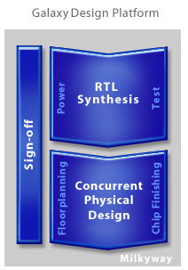
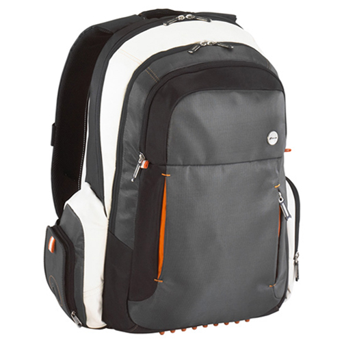

HDL을 이용해서 로직을 설계하고, 비메모리 반도체 만드는 사람들에게 있어서 필수 설계 도구(CAD)툴로는 synopsys의 design compiler를 들수 있겠습니다.

로직 합성 분야에서 약 90%이상의 점유율을 보이고 있는 것으로 조사(ESNUG에 따르면)되고 있으니, 거의 표준 설계 도구겠지요..

이 synopsys에서 오늘 miniDAC을 진행했습니다. babyworm은 이런 쇼를 좋아하는 편이라 올해도 빠지지 않고 갔지요. 시납시스에 있어서 가장 중요한 이슈는 이제 더이상 로직합성이 아닙니다 (가장 중요한 돈 벌이도구임에는 틀림없고, 여전히 중요합니다만..). 
전체 설계 과정인 “HDL설계 및 시뮬레이션” -> “로직 합성” -> “auto P&R” 과정에서 중간에서 압도적인 점유율을 가지고 있고, 가장 중요한 과정을 잡고 있는 시납시스는 요즘 auto P&R부분에 상당한 신경을 쓰고 있습니다. 
즉, HDL 설계 이후의 모든 과정을 점유하고자 하는 의욕을 보이고 있고, 그 성과는 아주 가시적으로 보입니다. auto P&R에서 한창 잘 나가던 apollo라는 툴을 가지고 있던 avant!사를 인수합병하면서, 새롭게 astro라는 툴을 내놓았고(사실 거의 apollo와 비슷했습니다.), 이제는 design compiler의 GUI인 design vision과 유사한 모양새를 가진 IC compiler를 주력으로 만들었으니까요.

시납시스에서는 Galaxy Design Platform을 표방하고, 로직 합성과 physical synthesis, P&R 과정을 하나의 플랫폼으로 동일한 DB를 묶는 큰 과정을 벌이고 있습니다.

이러한 과정은 예정되어 있던 수순이라고 할수 있는데, 좀 아쉬운 면이 있습니다.
사실 2년전쯤에 ESNUG에서는 RTL2GDSII라는 툴로 시끌 시끌했습니다. 위의 모든 과정을 하나로 묶는 굉장한 툴을 시납시스에서 개발중이라는 루머가 흘러나왔고, 이 툴이 IC-Compiler라는 이름으로 이름 지워졌다는 이유였습니다.

하지만, 공개된 결과는 실망스럽게도 Design-Compiler부분을 건드리지 않는 방법(하지만, design compiler 에서 virtual P&R을 하면서 정밀도를 높이는 – topological synthesiss – 방법을 사용하는)을 이용하는 것으로 결정되었기 때문입니다.
사실, 현재의 모양도 거의 합성 과정에서 P&R이 고려되고, P&R과정에서 합성도 병행되므로 합치려 했다는 말이 설득력이 있으며, 합치는 것이 더 맞겠지요..
아마도, 두가지 툴을 합치면 과도한 프로그램 값을 받아야 한다는 압박감.. (이 전체 플로우를 합치면 툴값만 한 10억하니까.. 여러툴에 10억을 지출할 회사도 1툴에 10억을 지출할 회사가 많을까.. 하는 의구심이랄까요.. 게다가 로직합성까지만 하는 회사도 많고, p&r만하는 회사도 많으니까요..), 혹은 수익에 대한 고려.. 이런게 아니었을까 싶습니다.

시납시스의 최근 miniDAC은 power minimization, 특히 clock gating/(MTCMOS를 이용한) power gating.
DFM에서 더 나아간 DFY. DesignWare (verification) IP, system verilog에 대한 적극적인 지원.. 이렇게 진행됩니다.

사실 첫번째 아이템은 항상 제가 관심을 가지고 보는 것인데.. 사실 power gating의 경우 공정에서 지원해 줘야 하는 것이니.. 좀 어려움이 많고요.. (TSMC와 같은 leading fab이 아닌 경우 별로 지원 안해줍니다…)
clock gating에 필요한 ICG cell도 사실 SMIC나 GSMC모두 구하기가 상당히 어려웠습니다. (말도 안되는 이야기같지만, 디자인 하우스의 이야기를 믿자면.. 국내에서 저희회사에서 처음으로 요구했다네요.. 왠지 신뢰가 안가는 말입니다.. clock gating은 외국에서라면 자주 쓰는 건데 말입니다… 아무 둘러댄거 아닌가 생각하는데, 사실이라면 좀 심각합니다.  )

DFM, DFY는 physical synthesis, P&R에서 고려되는 부분이니, 저희 같은 front end회사는 좀 밋밋한 느낌입니다. (볼때마다.. 아~ 그래야지~  그런 느낌이랄까요)

DesignWare verification IP를 국내에서 대기업말고 쓰는 곳이 있을지 좀 의문도 들구요.. ^^; 워낙 비싼데다가, 국내 ASIC회사중에 그정도로 검증에 대한 인식이 있는 회사가 있을까요?

System Verilog에 대한 지원은 좀 의외이긴 합니다. 사실 SystemC가 synopsys/cadence의 지원으로 커가고 있는 중이어서, 예전에 systemC에 대한 지원을 시납시스에서 줄일 예정이라는 말을 들었을때… “에이~ 거짓말~”.. 그랬는데.. 사실인지도 모르겠습니다.

SCV를 필두로 cadence의 영향력이 systemC에 커지는 것이 별로 보기 안좋게 여겨져서, system verilog에 대한 지원을 강화하는 걸로 나타났는지도..

사실 miniDAC에 가면 선/후배들을 볼 기회가 많아서 오랫만에 사람보는 재미도 있고 합니다.

오늘의 miniDAC에서 생긴 수익은…바로.. 이겁니다.

  

  

    시납시스에서 준 타거스 가방

가끔은 이맛에 EDA vendor쇼에 갑니다.
