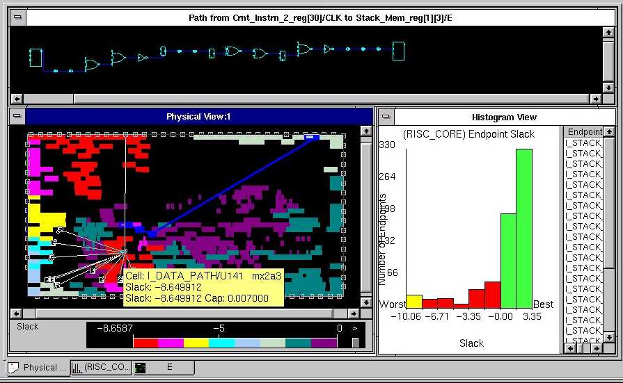
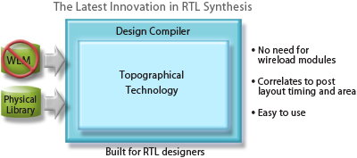

로직 합성에 많이 사용되는 Design Compiler에서는 전통적으로 통계적인 wire load model을 이용하였습니다. 
즉, 합성된 로직의 크기가 어느정도라면, 이때 적용되는 wire의 R, C값이 어느정도가 될지 대략 통계값을 통하여 추정하는 방법입니다.

이러한 wire load model은 0.35um 이전의 공정까지는 어느정도 적용하는데 큰 무리가 없었습니다. 
왜냐하면, 로직의 지연(delay)에 있어서 대부분이 cell이라 불리는 logic primivie에서 발생하였기 때문입니다.

그러나, 0.18um 이하의 공정으로 내려가면서 wire load model(이후 WLM)을 이용하는 방법은 한계에 부딛히게 되는데요, cell에 의한 경로 못지않게 wire delay의 비중이 커졌으며, 요즘에 와서는 cell보다 wire delay의 비중이 많이 늘어났기 때문입니다. 
따라서, 기존의 WLM을 이용해서 합성한 모델은 그 정확성에 문제가 있기때문에 P&R을 하고 난 이후의 결과와 현격한 차이가 발생하여, synthesis -> P&R -> in-place optimization의 과정을 수회 거쳐야지만 정상적인 chip을 만들어낼 수 있게되는 것입니다. 이는 전반적으로 설계 효율시간에 문제를 발생시킵니다. 
(보통 synthesis에서 10%이상의 over constraint를 주고 합성해야, P&R에서 비슷한 값을 얻을 수 있곤합니다. 이러한 문제가 발생하는 가장 큰 이유는 WLM의 부정확성에 있습니다.)

이를 극복하기 위하여 처음에 나왔던 방법은 Custom WLM방법입니다. 
즉, 시작은 WLM으로 합성하고, P&R을 통하여 Custom WLM을 만들어낸 후 이를 이용하여 synthesis함으로써 해당 칩에 좀더 가까운 wire load model을 사용할 수 있도록 하자는 방법입니다. 
이 방법은 0.35um부터는 당연히 사용되어야 하는 방법으로 정착하였습니다.

또다른 방법은 physical synthsis라는 방법인데, physical compiler라는 설계 도구에서 방법적으로 정착되었습니다.
 
이는 synthesis단계에서 pdef(floorplane정보)를 이용하여 가상적으로 place를 해보고 이를 이용해서 각 cell간에 좀더 정확한 경로 지연을 찾아낸다는 기법이었습니다.

 
이렇게 발전해 나가던 것이 이제는 DC에 모두 통합되었습니다. 
DC ultra에서 topographical synthesis라는 이름으로 모두 통합되었습니다.

이전의 DC ultra는 automatic hierarchycal ungroup과 같은 기능을 가지고 있는 것이었는데, 이제는 physical compiler에서 발전한 topographical synthesis기능까지 추가되어, P&R이후와 가장 근접한 형태로 합성해 낸다고 합니다.

 
 
뭐, synopsys의 발표자료는 거의 다 좋다는 것이겠구요..^^;

ESUNG에 보니 상당히 개선된 것 같습니다. (<http://www.deepchip.com/items/0457-05.html>) 
회사에서는 라이센스 비용 관계로 아직 사용하지 못하지만.. (ㅠㅠ) 아주 기대되는 기술입니다.
