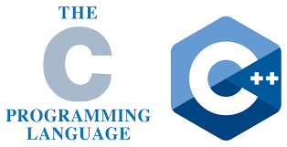

CN님의 블로그에서 “[가장 어리석은 선택: C언어][1]“라는 약간은 자극적인 글을 보고나니, 제목자체에서는 약간 거부감이 있었습니다만, 본문과 댓글을 보고는 여러가지 공감도 가고 그렇습니다. 여하튼..

제 입장에서 생각하면, C언어는 배울만한 충분한 이유가 있는 언어이나 학교에서의 교육 방법에 문제가 있는 것이 아닐까하는 생각을 합니다.

컴퓨터 공학 교육이 언어 및 머신에 대하여 독립적이면 좋다는 것은 맞습니다만, 컴퓨터 공학 분야의 대부분의 이론이 언어를 사용하지 않고 수학적 이론으로 풀면 상당히 어려운 수준에 도달합니다. (저 같은 경우 대학원 과정에서 컴퓨터에서의 덧셈 연산 수행 과정을 수학적으로 모델링하고 분석하는 법을 배웠을때 솔직히 머리 터지는 줄 알았습니다. ^^; )
 
따라서, 예가 될 수 있는 언어를 사용하는 것이 좋겠지요.

그 예제 언어로서 가장 많이 사용되는 것이 C/C++/java 시리즈인데요..
 
CN님의 비판 포인트는 C 형제들이 이런 목적에 부합하냐.. 이것이시겠죠.. ^^;
 
다른 좋은 언어도 많은데.. 교육적으로..

네.. 제 생각에도 학생들이 C언어라는 것을 배우는 것은 매우 이른 시점이며, 대부분 컴퓨터 시스템에 대한 이해가 없는 상태에서 컴퓨터 시스템에 대한 이해가 필요한 C언어를 배운다는 것이 비극의 시작이라고 생각합니다.
 
더 중요한 문제는 많은 교수님들/강사님들께서 문제 출제를 위하여, 별 필요없는 문법적 지식에 목을 매서, 아주 희안한 코드를 그려넣고 이게 어떻게 동작할지 맞춰보라는 문제를 내기 때문에 좌절스러운 것이라 생각합니다.
 
예를 들어, printf의 그 많은 format을 알아서 뭐하겠습니까.. 간단히 훓고 지나가서 나중에 필요할때 reference manual보면 되죠.. 포인터의 포인터의 포인터, 포인터의 괄호 결합 순서를 배워서 뭐하겠습니까? ^^;
 
물론 필요 있습니다만, 이거 쓰는 경우 거의 없잖아요.. 근데, 문제내기 좋은 항목들이니 자세히 알려줍니다.
 
많은 학생들이 C 언어의 pointer 부분에서 절망하는 가장 큰 이유는 컴퓨터 구조에 대한 이해가 없는 상태에서 pointer를 무지막지하게 가르킨다는 점때문이라 생각합니다.

C언어를 가르키는 이유가 절차적 언어에 대한 감각을 익히고, 컴퓨터 시스템에 대한 전반을 이해하는 것으로 목표를 두어야 하고, 거기에 C를 배우는 가치가 있다고 생각하는데.. 현실의 교육은 언어적 테크닉에 집착하는 경우가 많으니까요..(사실 말이 쉽지 가르킬때 쉽지 않을 것이라는 것을 너무도 잘 압니다.)

Computer architecture를 전공한 입장에서 이야기드리자면..

Computer architecture라는 개념적인 과목보다 C가 앞에 있어야 하냐는 판단하기 어렵습니다. 단, C에 익숙한 친구들은 computer architecture 과목에서 많은 부분을 쉽게 따라오는 것이 사실입니다.

그럼 computer architecture가 1학년 과목으로 가면… 너무 가혹하겠지요.. ^^;
 
포인터에 사용되는 memory system도 머리가 아픈 판국에 register니, bus니 배우는 건 아무리 봐도 좀 무리가 있습니다.
 
게다가 assembly 언어를 고급언어에서 배웠을 개념적인 도움없이 직접 들어가는 건 설명하기가 너무 어렵더군요..
 
3학년 과목으로 간다면.. computer architecture가 기반이 되어야 할 compiler 이론이나(물론 machine dependent optimization을 고려하지 않은 RTL상태의 최적화만 다룬다면 가능하겠습니다만..), OS 이론, digital system쪽은 4학년으로 이동해야 하는 불행이 있겠구요..

여러면으로 보았을때 컴퓨터 시스템에 대한 기반을 알려줄수 있는 C가 선두에 서는 것이 유리하죠..
 
단지 문제는 받아들일 준비가 안된 학생들에게 C가 튀어나오면서 “언어”와 “구조” 두가지를 모두 강요하다 보니 벅차다는 것이 문제겠죠.. 그걸 잘 연계해서 알려주시는 분들도 부족하구요..

C 언어의 효용성 부분인데요..
 
우선, C 언어를 배우면서 컴퓨터 시스템 전반에 대한 이해를 얻을 수 있구요(제대로 배웠을때 이야기지요..^^;)
 
(제가 소프트웨어직에 종사하지는 않습니다만)소프트웨어 분야에서 C/C++/java의 위상이 그렇게 떨어지지는 않았을것이라고 생각하구요..^^;
 
제가 종사하는 ASIC, SoC 쪽이나 관련있는 embedded 쪽은 C/C++를 모르면 좀 살아가는 것이 어렵겠다 싶을 정도로 중요합니다. 정말 “언어”처럼 사용되거든요.. 문서로 수십장 적어서 동작을 기술하는 것보다 C로 간단히 함수 하나 던져주는 것이 더 명백하거든요.(executable spec이라해서, 매우 일반화되어 있답니다.)

C 언어는 computer architecture로 가는 길을 열어주는 언어이기 때문에 어찌보면 최선의 선택이라 할수 있지만, 학생의 입장에서는 부담되는 언어임이 확실하고.. 만일 C 언어의 교육 이유를 이해하지 못하는 교육자분들께서 수업을 맡으신다면 최악의 선택이 되겠습니다.

역시 최선과 최악은 붙어있는 건가요..^^;

p.s.
 
그러고보니, computer architecture에 대한 이해가 필요없는 분야에서는 뭐 굳이 C가 필요없지 않을까요?
 
교양과목으로서의 컴퓨터 언어로는 정규식도 배울수 있고 제어구조도 나쁘지 않은 perl, python 형제같은 것이 훨씬 더 편하지 않을까 생각되네요..(다른 많은 언어가 있겠습니다만.. 제가 아는 언어는 몇개 없는 관계로..)
 
그런데.. computer architecure의 기반이 필요치 않은 CS쪽 과목이 별로 없을 것 같은데..

 [1]: http://blog.cnrocks.net/article-229/c-programming-language-considered-harmful
