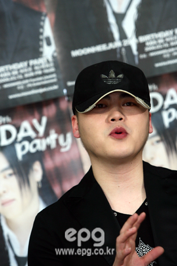

사진 출처: http://photo.epg.co.kr/photo/epzine/article/2006/5/13/10624_1.jpg

국군의 날 기념 열린 음악회..
 
군 복무중인 가수들을 볼수 있어서 좋은 기회이긴 한데..

문희준군의 열창 뒤에 김범수가 나올건 또 뭐람..
 
문희준군 군대가서 가창력이 좀 나아졌나.. 하고 유심히 들어보고 있었는데, 바로 뒤에 김범수가 나와서 노래 부르면 어쩌라고…좀 심한 편성아냐..

문희준군이 아이돌 출신에서 락커로 변신하고.. 여러가지 입방정(그중에 많은 건 거짓이라지만..)에 안티가 많이 늘어났지만..
 
어린나이에 많은 팬들이 좋아해주다보면 그럴수도 있다고 봅니다.
 
예전에 허재 아저씨도 나이들어서 회고하길 “모두 내가 최고라고 하니, 정말 최고인줄 알았다..그땐 어렸다”고 하지 않습니까..

문희준씨가 열심히 노력해서 안티팬을 음악으로 인정받게 해주는 날이 올수도 있겠죠..
