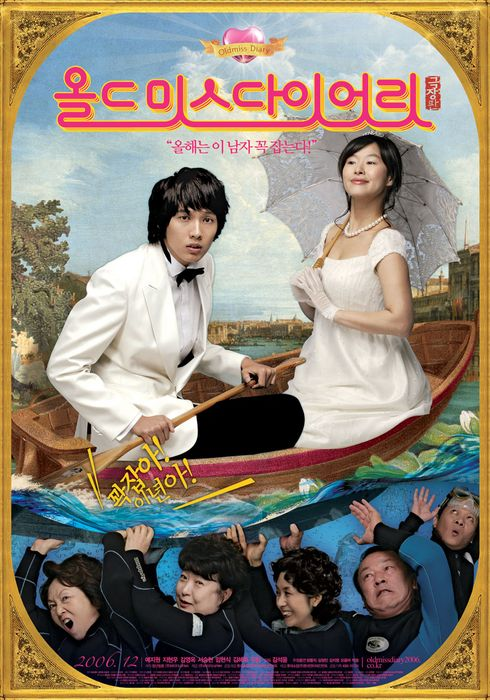

오랫만에 쓰는 영화관련 포스팅이네요..

큰 스포일러는 없으니 안심하세요..

오늘 마눌님과 올드미스 다이어리를 보고왔습니다. 
저는 이 드라마를 본적이 전혀 없는데 전혀 무리없이 볼 수 있었습니다.

 
아.. 정신없이 웃다가 가슴도 좀 뭉클해지다가 나왔습니다. 
근데, 가슴 뭉클해지는 장면이 알고보면 그리 뭐 뭉클할 장면은 아닌데.. 주인공의 감정이 잘 이입되어서 그런 결과가 나온거죠. 마눌님은 눈물도 약간..^^

한마디로, 이 영화 만든 분이 감정의 선을 잘 조절하면서 관객을 유도해나갔기 때문에, 그 장면에서 주인공의 감정이 관객에게 잘 이입된것 같습니다.

오랫만에 잘 만들어진 드라마 한편을 봤습니다.

주연분들의 연기도 좋아고, 조연들도 그 특성을 잃지 않고 캐릭터가 잘 살아나는 점이 더 맛깔나게 하는 영화입니다. 할머님들의 연기 정말 최고~! 특히 김영옥 할머님..

예지원씨는 그 동안 다른 영화에서의 이미지를 바꿔주는 캐릭터더군요.. 아주 캐릭터를 잘 살렸어요.. 
주변의 반응은 드라마 원작이 아니었으면 더 성공했을지도 모르겠다..라는 반응도 있군요.. 워낙 성공한 드라마(저는 안 봤지만..)를 기반에 두고 있어서, 보기전에는 ‘드라마 인기에 편승한 얇팍한 영화 아냐?’라는 생각이 있었다니까요..

주말에 심심하신 분은 가서 보시길.. ^^;
