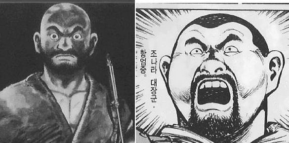

묵공이 원래 일본 만화가 원작이라는 것은 아실 분은 아실텐데요.. (아마도 많은 분이 아시지 않을까 생각합니다.)
원작 만화의 첫 이야기인 양성에서의 공방에 대한 이야기를 영화화 한것이지요.

유덕화와 안성기라는 화려한 캐스팅으로 영화화된 기대에 비하면, 영화 평은 갈리고 있습니다.
하지만, 개인적으로 모리 히테키라는 작자에 의하여 탄생된 묵공이라는 만화는 많은 것을 느끼게 해준 만화입니다.
절대 공격하는 전쟁을 하지 않고, 방어에 특화된 묵가인 혁리에 대한 이야기를 풀어내고 있습니다.

만화 자체는 사실 좀 잔인한 장면이 상당수 있습니다.
만화에서 이야기하려는 주제에서 가장 중요한 것 중에 하나가 바로 “전쟁의 무의미함과 잔혹함”이 때문이죠.

이 만화의 또다른 재미는 전쟁이라는 상황에서 변해가는 사람들의 모습.. 그리고, 전쟁이라는 상황에서도 오로지 자신의 자리를 지키려, 오히려 지키려 노력하는 사람들을 음해하는 사람들과 같이 사람에 대한 이야기도 볼만합니다. 뭐, 전쟁에 관한 이야기기만큼 전략에 대한 것도 볼만하지만, 이 책에서만의 뛰어난 부분은 아니니까요..

안성기가 맡은 “항엄중”(영화에서도 맞죠?)에 대해서 악역이 아니냐는 이야기가 많은데..
악역이 아닌 성을 함략시켜야 하는 입장을 지닌 지,덕을 겸비한 명장입니다.
단지 좀 만화에서의 이미지와는 좀 다른 안성기가 캐스팅되긴 했습니다만.. (하긴.. 그렇게 이야기 하면 혁리역의 유덕화는 더 말이 안되겠지요..)

