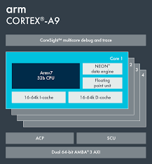

에서 Cortex-A9을 발표하였다고 합니다 [ZDNet 기사](http://www.zdnet.co.kr/news/enterprise/cpu/0,39031075,39161980,00.htm). 일단 저에게 있어서는 한숨 쉬어지는 일이고(ARM의 행보가 점차 빨라지니, 저희같은 업체가 따라잡을 수 있는 여지가 줄어들고 있는 것이 사실이니 말입니다.), 업계에 있어서는 환영할 만한 일이겠습니다.

Cortex-A9의 경우 4개 까지 MP로 구성이 가능하다고 하니(MP 구성을 따지는 것으로 보아, cache snooping이 고려된 SMP겠지요..), 대단한 성능을 기대할 수 있겠습니다.

여기서 재미있는 것이 Intel의 대응인데요. 기존에 ARM 기반의 프로세서를 만들다가 해당 부분을 과감히 정리하였지요.
 
근데, EETimes에 의하면 Intel이 의 프로세서를 라이센스했다고 합니다.
 
ARM 기반을 정리할 때는 x86기반의 embedded processor쪽으로 무게를 둔다고 생각했는데, 범용쪽은 x86기반, 저전력이 요구되는 application specific한 부분은 configurable processor인 ARC쪽에 무게를 두는 느낌입니다.
 
그래도, x86기반에서도 충분히 configurable하게 만드는데 어려움이 없을 것인데.. 저전력을 위해서 이런 결정을 내린 것이 아닌가 하는 생각입니다.

이러한 행보에 맞추어 저희 회사에서는 Heterogeneous MPSoC쪽에 무게를 두고, 여기에 적합한 lightweight/low power processor와 interconnection에 무게를 두고 있습니다.
 
몇 가지 재미있는 아키텍처적인 시도를 구상하고 있는데, 보도 자료에는 좀 이상하게 나간 느낌이 있습니다. 물론, 마케팅적인 측면을 위해서 빠른 프로세서를 만들어야 겠다는 생각은 변함이 없습니다만.. 실제로 MPSoC에서 중요한 것은 적절한 성능의 작은 footprint를 지닌  low power 프로세서들이니까요. (적절한 성능이란 것이 task에 따라 바뀌는 것이므로, 아주 강력한 프로세서를 개발해야 할 필요성도 있는 것이지요)

뭔가 흥미 진진해질 것 같아요.
