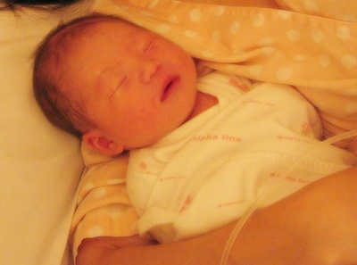

2008년 2월 16일, 11시 44분에 3.34kg, 50cm의 키로 몽실이가 태어났습니다.

안사람은 태어나기 몇 일전부터 주기적인 진통을 느꼈지만, 아직은 진통의 강도가 그렇게 세지 않다고 해서 설마 토요일에 태어나게 될지는 아무도 예상하지 못했었습니다. 많이 아프다고 해서 병원에 간 것이 새벽 5:30분이니 약 6시간 가량 아주 심한 진통을 했습니다. 옆에서 보기가 딱할 정도로.. 몽실아.. 엄마한테 꼭 잘 해야해~

태어나는 순간은 정말 눈 깜짝할 순간에 아이가 나오더군요. 그리고, 바로 울음… 태어난 아기를 저와 안사람에게 보여줄 때 눈을 뜨고 바라보더군요.
얼굴은 이상하게도 익숙해요 ^^; 초음파를 많이 봐서 그런지, 아니면 저나 처의 얼굴을 닮아서 그런건지 아직은 잘 모르겠습니다.
3시간 정도 지났을 때 사진인데, 생긴것이 꼭 복숭아처럼 생겼지요.. 처음에 비하면 붓기가 많이 빠진 상태입니다.

하루 지나서는 더 붓기가 빠진 모습이지요.. 거의 지금 모습과 비슷해요.
이름을 빨리 지어주는 것이 가장 큰 과제인데, 제가 생각한 이름들은 대부분 안사람 친구들의 이름이나, 안사람 친척이나, 저희 친척들과 이름이 같더군요. 에휴…

잘 키우겠습니다.

 
