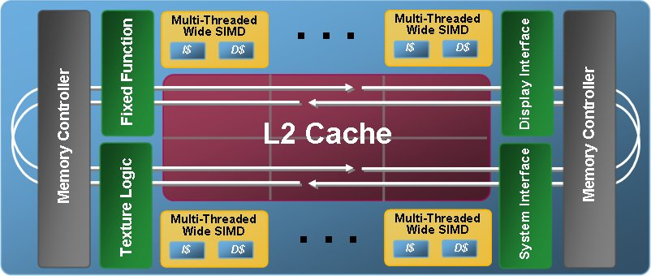
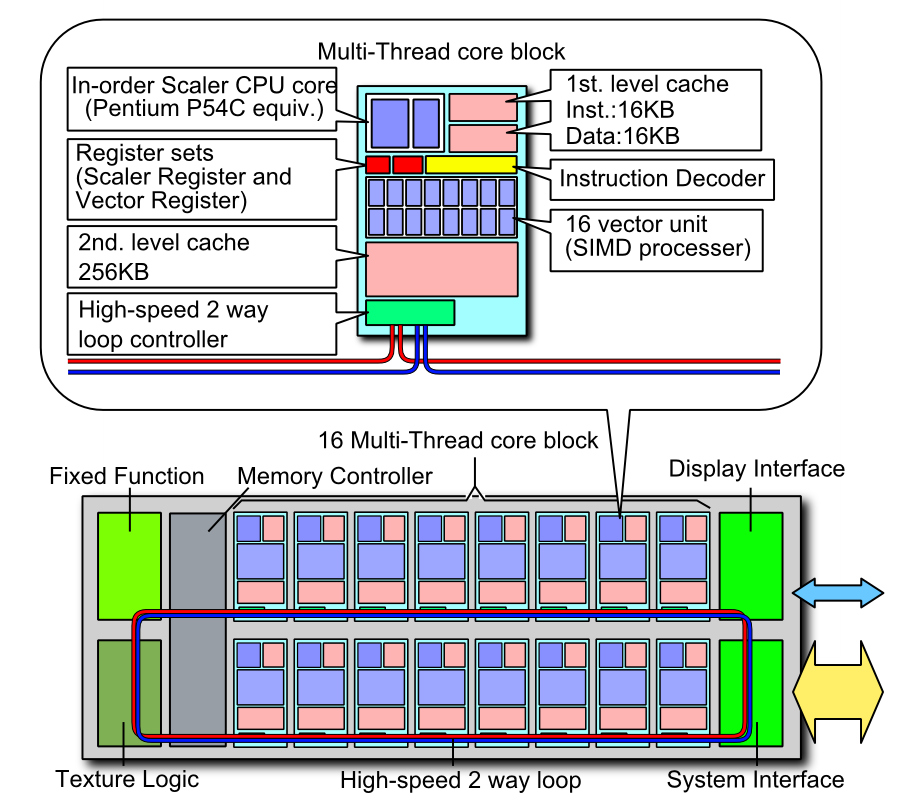

제가 자주 그렇게 하고 있습니다만, 이 글은 <A href="http://www.mdronline.com/mpr/h/2008/0929/223901.html">MPR의 기사</A>와 몇몇 논문을 기반으로 하고 있습니다. 읽고 제 맘대로 쓰는 글이라 항상 그렇듯 모두 맞는 내용을 쓰고 있다는 보장은 없어요. 

Intel이 새로운 UFO를 주워서 새로운 장난감을 만들었습니다 ^^; 사실 인텔에게 GPU는 생소한 분야가 아닙니다. 이미 GPU 분야에서 상당한 – 실제적으로는 모든 마켓을 고려했을 때는 가장 큰- 마켓 쉐어를 가지고 있으니까요.. (근데, 아직도 이런가요? 몇년전엔 맞는 이야기인데, 아직도 이런지는 확신이 없네요. )

### 돌아가는 상황

Intel이 x86 기반으로 데스크 탑과 서버 시장을 장악하고 있다는 것이야 다들 아는 사실이고, 예전에 예상했듯이 strongARM과 XScale 사업을 버린 이유가, [x86기반으로 embedded 시장에 도전하려는 것][1]이라는 것도 [실제로 나타났지요][2]. 오히려 예상보다 느린 행보라 약간 의아할 뿐입니다.
 
실제적으로 ARM과 불꽃 튀게 붙게 될 시점은 2010년 정도로 보고 있습니다. ARM에서 저전력을 가지고 이러니 저러니 해도 Intel은 아직 SoC를 만든 것이 아니라, mobile processor를 embedded 시장에 맞도록 한번 바꾼 정도라고 보시는 것이 맞을 것입니다.
 
즉, ARM에서 내세우는 저전력의 우세는 ARM에서 그러하듯이 intel이 대부분의 peripheral을 on-chip화 시켜 SoC를 만들어내는 2010년 정도에 따져볼 일입니다.
 
게다가 [이전에 썼듯이][3] ARM의 Cortex-A9의 경우 기존의 A8과 비교하여 여전히 energy-efficient할 것인지 의문입니다. (물론, 2-way까지는 Instruction Level Parallelism 가 충분하므로 어느 정도 까지는 문제가 없겠지요 ^^;)

### Intel의 새로운 GPU; [Larrabee][4]

- https://pages.cs.wisc.edu/~markhill/restricted/siggraph08_larrabee.pdf

이러한 상황에서 Intel이 새로 내놓은 GPU는 기존의 3D accelerator와 차이가 많습니다.
 
각 core당 16-lane SIMD 와 4개의 thread를 지원하고, NoC를 기반으로 하여 필요에 따라 다수의 코어를 연결할 수 있는 형태의 범용성 높은 프로세서를 만든거죠.
 
Larabee는 일종의 NoC 기반의 array/vector processor 형태를 취하고 있는 것으로 보시면 되겠습니다. GPU가 GPGPU를 내세우니, 그동안 잘 알려진 general processor형태로 GPU를 공략했다고 할까요 ^^;

이런 형태나 시도가 없었던 건 아니죠.
 
약간 모양이나 형태가 다르긴 합니다만, media processor도 이런 형태의 접근이죠. dedicated engine을 사용하지 않고, 범용성 높은 vector processing unit으로 시장을 공략했었던 것이지요.
 
단지, 그 당시에는 여러가지 이유로 이러한 시도가 실패했는데, 뭐 다들 짐작하시듯 전용 엔진이 범용 엔진보다 전력 소모, 효율 면에서 앞서기 때문이죠(게다가, 당시 3D accelerator는 rasterizer 부분에 포커싱 되어 있어서 범용성이 매우 떨어졌습니다).
 
그런데, 이번에 이런 시도는 어찌보면, GPU 가 이런 저런 기능을 GPU에 넣다보니, 파이프라인과 연산의 형태가 GPGPU를 시도할 만큼 범용성을 갖춘 시점이기 때문에 가능한 한번 싸워 볼만한 시점이 된 것이기 때문이라 보입니다.
 
GPGPU를 하느니 첨부터 vector-array processing을 해서 programmability를 높이는 접근이 좋지 않냐..라는 거겠죠.

게다가, 명령어 셋을 x86 기반으로 가져가니, 어렵게 GPGPU를 위한 언어를 따로 쓸 필요도 없지요. (병렬 프로그래밍이나 컴파일 문제는 따로 이야기하더라도..).
 
이 부분은 기존에 이미 multiprocessor를 위하여 작성된 대부분의 x86 기반의 프로그램이 아주 잘 동작할 것이라는 것이고, multiprocessor를 위한 것이 아니라도 recompile이 필요하진 않을 거라는 거죠.
 
즉, 이미 잘 구성되어 있는 x86의 컴파일러들과 multicore를 위한 지원등을 그대로 이용할 수 있다는 아주 큰 장점을 지닙니다. (GPGPU의 가장 큰 진입 장벽이 새로운 renderer 명령을 배워서 써야 한다는 점을 생각하면 이해하기 쉽습니다.)

상황에 대한 이야기는 대충 된 것 같고, 전체 구조는 아래와 같습니다. (인터넷 찾으니 그림이 많군요 ^^; 원본 그림은 watermarking 된것 처럼 TECHARP.com에서 온 것 같습니다. google image검색에서 따 온거라 ^^;)

각 코어의 scalar/vector processing datapath의 그림은 위와 같구요. 위의 두 그림을 보고 알 수 있는 것은 dedicated L1의 형태를 지닌 vector 프로세서를 NoC(interprocessor ring network) 기반으로 array 형태로 배치한 것을 알 수 있습니다. 첫 그림을 보면 shared 형태의 L2처럼 보이는데, 실은 coherent L2 cache입니다. 코어의 수가 늘어나면 다수의 NoC를 배치한다고 하네요. 그래픽(visual computing)을 타켓으로 하다보니 dedicated accelerator와 몇몇 블록들이 존재 하구요.

형태상으로는 전반적으로 thread level parallelism과 data parallelism을 극대화시키기 위한 형태라고 생각됩니다. 흠.. 근데, snooping에 의한 traffic문제는 어떻게 할지 좀 궁금하긴 해요. NoC 에서 snooping에 의한 traffic이 만만치 않을 것 같은데, 주된 application이 vector processing이라 생각하면 그다지 많지 않을 것 같기도 하구요.

요즘 흘러가는 것을 보면, 예전에 한번 실패했던 재미있는 테마들이 새로운 응용 분야, 기술의 발전에 힘입어 재미있게 융합되어 부활하는 것 같아서 흥미진진합니다.
