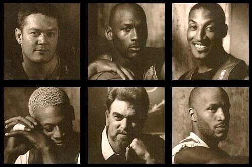

## Bulls
Picasa를 이용해서 이리 저리 둘러보다 발견한 그림.

한창 NBA 붐이 일어났던 그 시절.. . 최고의 팀.

그 당시에 정말 농구 붐이었죠. 최고로 수비적이면서 최고로 공격적인 팀.. 가장 드라마틱한 순간을 만들어내는 팀. 그런 이야기가 무색하지 않았습니다. 개성 강한 플레이어들을 묶는 Jackson 감독이 있었기에 가능했던 것이라 생각되는 팀이지요.

올랜도 매직, 시애틀 슈퍼 소닉스와의 결승도 재미있었지만, 가장 재미있던 경기는 아무래도 재즈와의 경기였지 않았나 싶어요. 극적이기도 하고.. 나중에 youtube에서 찾으면 link하도록 하죠.

또 보고 싶네요.

## Invitations

이런 저런 초대장이 생겼습니다. 뿌립니다.

-    TiStory 초대장 8매: 이제야 다들 가입해서 별로 필요할것 같지 않지만.. 리플로 e-mail 주소 주시는 분이 혹시라도 있으시면 보내드립니다.
-    Miang 초대장 5매: 요즘 한창 난리인 초고속 P2P 미앙 초대장입니다. 미앙 P2P와 e-donky를 엮은 듯 하던데, 회사에 있는지라 제대로 사용은 못해봤습니다. 주변 반응은 괜찮은 듯 해요. 역시 리플로 e-mail 주소 주시는 분이 있으시면 보내드립니다.

e-mail 주소도 소중한 정보니까, 필요하시다면 비밀글로 써주세요

## 메리 크리스마스!

어려운 시기이지만 모두 좋은 결과 있기를 바라겠습니다!!!
