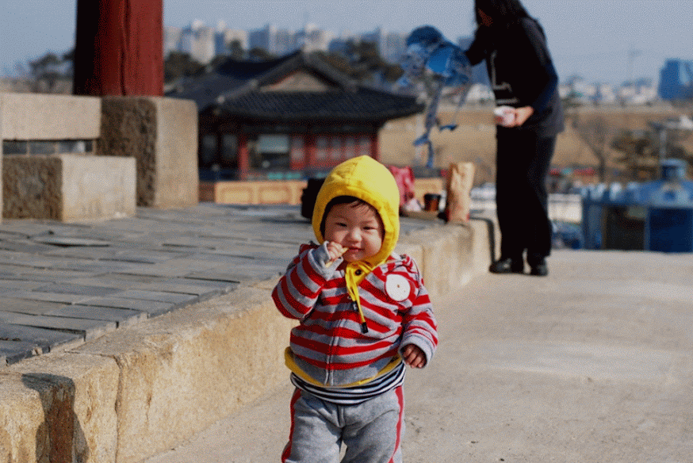
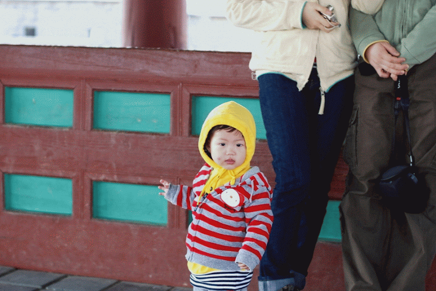
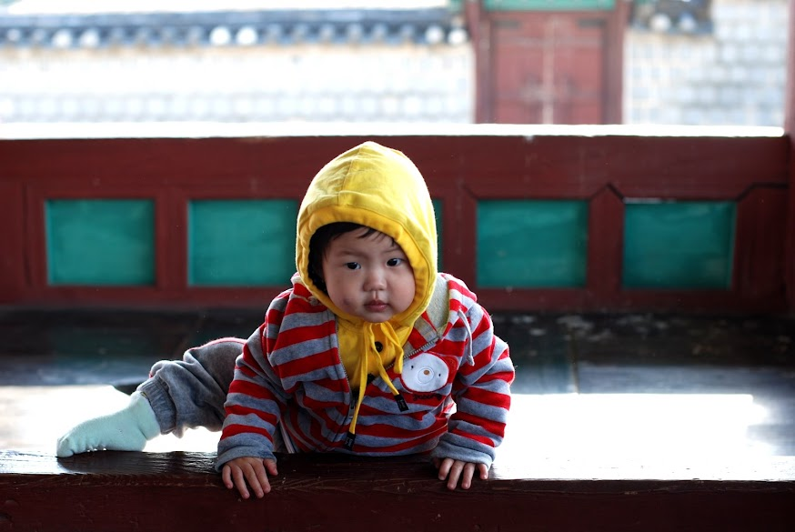
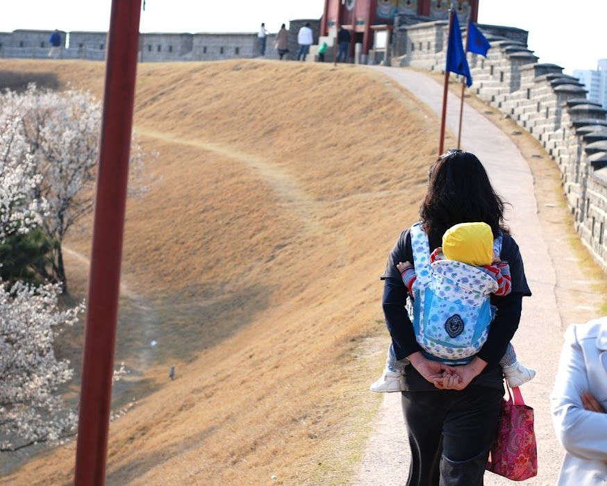
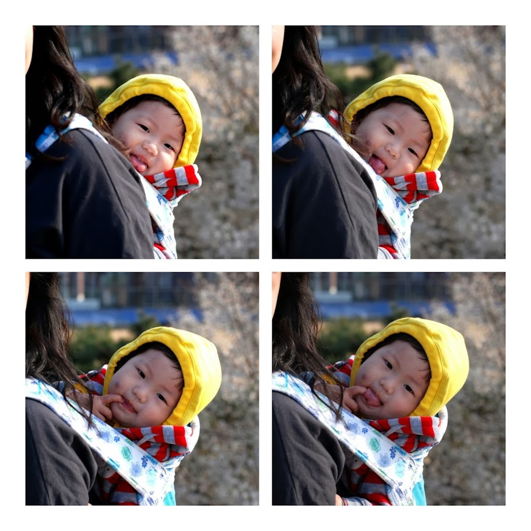
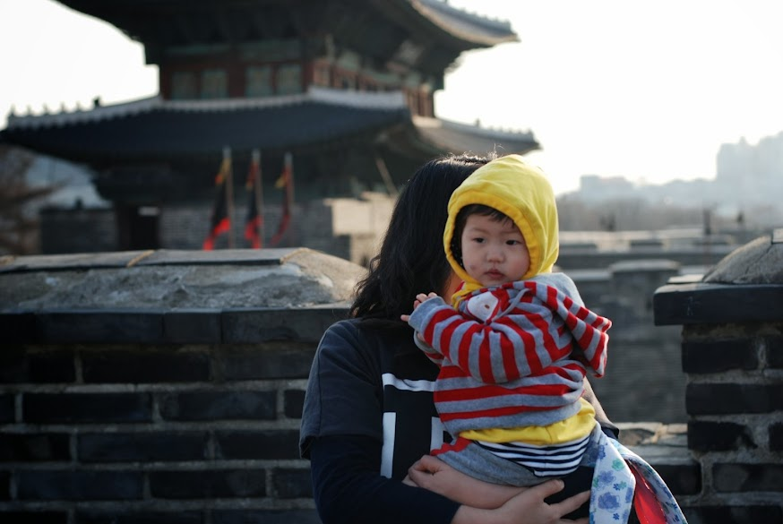
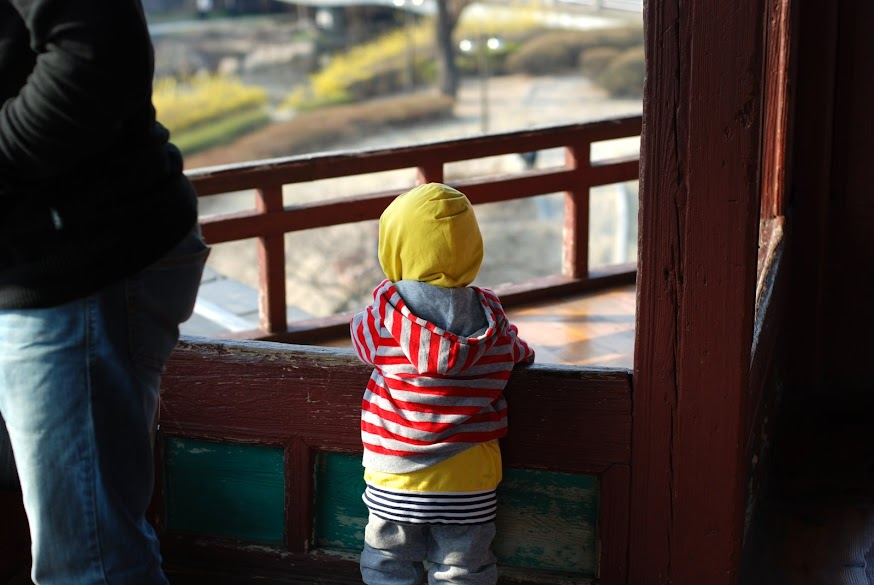

주말에 바람도 쐴 겸 집근처 수원 화성에 갔습니다.
그동안 항상 가려는 마음은 있었는데, 다양한 이유들 (바빠서, 병원때문에, 추워서, 귀찮아서..등등등등)로 인해서 처음으로 가 보게 되었습니다.

생각보다 엄청 가깝더군요. 창룡문까지는 차로 한 10분 정도 걸리더군요. 창룡문에 갔다가 화성 열차를 타 볼 요량으로 연무대 쪽으로 갔습니다만, 열차는 사람이 많아서 못타고 걸었습니다. 쉬엄쉬엄 연무대에서 장안문까지 걸었습니다.

전체 사진은 아래에서 보세요(지난 posting에 사진도 포함되어 있네요

일단 연무대 주차장 뒤에 있는 동장대에 갔습니다. 앞에는 국궁 체험장이 있지요.
민혜가 입메 물고 있는건 맥도날드 포테토.. 흠.. 처음 준건데, 무지 좋아하네요. 그래도 담부터는 자제를..

그야 말로 신났습니다. 이리 저리 둘러보고 있습니다. 이렇게 좋아하는데, 너무 안다닌 것 같아서 미안한 마음입니다.
동장대에서 커플이 셀카 찍는데 중간에 끼어서 이리 저리 따라다니고 있습니다.
궁뎅이를 씰룩씰룩하면서 따라다녀서 엄청 웃겼습니다.

안쪽에서 언니, 오빠들이 뛰어놀고 있었는데, 한번 끼어 볼까하고 올라오고 있습니다.

요즘 민혜가 아주 좋아하는 동물이 두 가지 있는데, 짹짹새와 멍멍이입니다. 가려고 하는데 새가 날아 오르니까 신이 났습니다.

방화수류정쪽으로 가는 길입니다. 옆에 벌써 벗꽃이 피었습니다.

엄마 아빠 메롱~

화홍문에 왔습니다. 경치가 좋더군요. 앞의 한국식 연못과 방화수류정도 이쁘구요.
같은 시간에 이 정자에서 무슨 무슨 역사 모임이 있어서 곁다리로 이런 저런 내용을 들을 수 있었습니다.

흐르는 물을 보면서 생각에 잠겨 있는 민혜.. 무슨 생각을 하는 걸까요.. 철없는 엄마 아빠를 어떻게 달래야 하는지 생각중인지도..

장안문에서 한컷. 옆에 비둘기가 있었는데, 비둘기를 보고 안아주고 싶었는지 달려오면서 안아주는 모습을 합니다. 계속 비둘기를 따라 다녔어요.

장안문 앞에는 꽤나 유명한 만두집 두 곳이 있는데, 한 곳은 “보용만두” 또 한 곳은 “보영만두”라는 집입니다.

보용만두가 원조인데, 거기 주방장이 나와서 그 앞에 보영만두를 차렸다는 슬픈(?) 이야기가 있는 곳이지요. 실제로 보용만두는 사람이 좀 적고(그래도 많죠), 보영만두는 줄을 서서 먹어야 했습니다.
평생에 줄을 서서 뭔가를 사게 될 것이라고 생각해본적이 없는데, 마눌님의 지시로 보영만두 앞에서 만두를 사기 위해서 거의 30분을 기다렸습니다.
솔직히 고향 만두 마니아인 저의 입맛에는 보용만두가 더 맛나더군요. 보영만두는 맛이 좀 흐려서 그냥 그랬어요. 그래도, 유명한 집이라니 한번 먹어보는 것도..(한번 먹어보는 정도가 아니고 실은 배터져 죽을뻔 했습니다.)

다음주에도 수원성에 들를까 생각중입니다.
