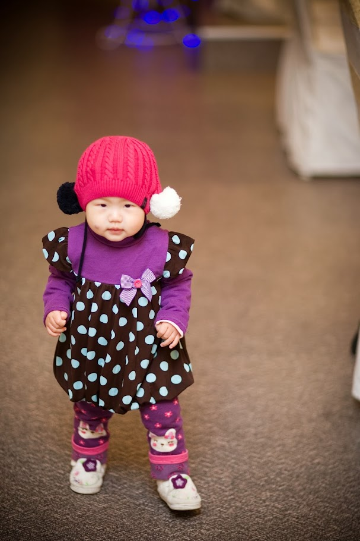

민혜와 같이 시간을 보내다보면, 시간이 어떻게 흘러갔는지 알수 없이 훌쩍 하루가 가버리는 경우가 허다하다.
민혜가 좋아하는 곰돌이 인형과 놀아주고, 민혜를 안고 민혜가 그렇게도 좋아하는 똑딱 똑딱 시계를 몇번씩 쳐다보고, 뽀끔뽀금 물고기와 인사하고, 벽에 걸려 있는 민혜 꼬까와 민혜 트리(크리스마스 트리 장식), 아기 사진(민혜 달력)을 몇번씩 순회하다 보면 허리도 지긋이 아픈것이 어느틈에 상당한 시간이 흐른 경우인 경우가 많다.
민혜가 좋아하는 ‘척'(처제가 사준 짐보리의 자석 장난감. 붙을 때 ‘척’ 소리가 나서 민혜가 ‘척’이라고 부른다)과 , 민혜가 좋아하는 ‘사랑해 사랑해’라는 동화책을 읽어주다 보면 어느틈엔가 시간이 많이 흘러 버린다.

아이와 있는 시간은 즐거운 시간이기도 하지만, 아이와 있느라고 그동안 온전히 누리던 의미없는 게으름의 시간이 줄어들게 되었다. 지금 돌아 생각해보면, 그 게으름의 시간이 얼마나 호사스러운 시간인가.
가끔은 그 호사스러운 시간을 위해서 민혜가 혼자 잘 노는 듯 하면 혼자 방으로 기어들어가서 아무 의미없는 인터넷, 신문, 만화, 영화를 둘러보곤 한다. 하지만, 이내 심심해진다.

민혜와 같이 있는 시간이 쉽지만은 않다. 가끔은 울기도 하고, 보채기도 하고, 계속 안아달라고 하기도 한다. 정말 가끔은 진짜 힘들때도 있다. 하지만, 그 순간이 지나고 나면 항상 같이 있지 못한다는 것이 얼마나 서운한 일인가 생각하곤 한다.

요즘엔 내가 민혜와 놀아주는 것이 아니고, 혹시 민혜가 아빠와 놀아주는 것이 아닌가 하느 생각이 들기도 한다. 내가 게으름을 피우러 방으로 들어가면 혹시 뒤에서 ‘아.. 아빠가 드디어 갔네.. 놀아주기도 힘들단 말야.. ‘하는 것이 아닌지 말이다.
나중에 몇년이 지나면 민혜가 아빠, 엄마와 같이 있는 곳보다 더 재미있는 친구들과 더 재미있는 세상을 찾게 될것이고, 아빠 엄마 보다는 친구들과 더 즐거운 시간을 보내길 워할 것이다. 우리가 그랬던 것 처럼..
엄청 아쉽겠지요.

민혜 엄마, 그런 날이 오기 전에 열심히 놀아주자구요.
나중엔 민혜가 ‘예의상’ 엄마 아빠와 놀아주게 될테니 말이지요.

이 사진은 개인적으로 참 여러가지 생각이 드는 사진이에요. 누가 안잡아줘도 걷을 수 있게 되었을 때입니다. 민혜 돌때가 민혜가 잘 걷기 시작한지 얼마 안되었을 때라 더 그런 느낌이 드는지 모르겠어요.
이렇게 엄마 아빠의 품을 떠나게 될 날이 오기 전에 열심히 키워야겠지요.
