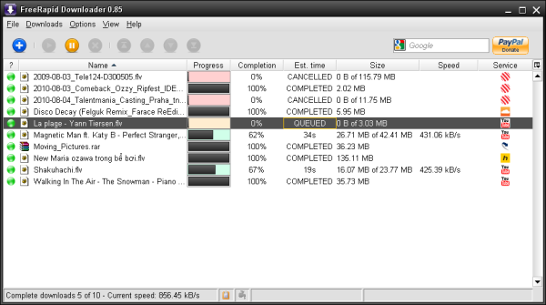

국내에서는 잘 이용하지 않지만, 이곳 저곳에서 자료실로 상당히 많이 이용하는 서비스로 Rapid Share라는 곳이 있습니다. 

저도 물론 잘 이용하지는 않았습니다만, 전자/IT쪽 e-book을 공유하는 어둠의 조직[^1]을 어찌 어찌 알게 되었는데 그쪽에서 rapid share를 이용하여서 요즘들어 가끔 사용하고 있지요.

그런데, rapid share를 이용하다보면 귀찮은 것이 free user의 경우 다운로드 받기 전에 한 30~40초 가량 대기해야 하고, 대기 한 후에 자료 다운 로드 정보를 클릭해 줘야 하고, 한 자료가 5M 정도 넘어가면 대역폭 제한 같은 것 문제로 그 다음 자료를 다운 받는데 1시간정도 기다려야 하는 귀찮은 문제가 있었지요.

오늘 말씀 드리는 <a href="http://wordrider.net/freerapid/" target="_blank">freeRapid downloader</a>는 이런 귀찮은 작업을 자동으로 해주는 툴입니다. (저는 이런 툴이 있으리라고 생각은 못했는데, 인터넷 찾아보니 상당한 숫자가 있더군요. 다들 rapid share의 정책이 귀찮은 것이겠지요)

그냥 URL을 주르르 붙여두면, 필요한 시간 만큼 대기하고 자동으로 다운로드 받아주는 툴입니다. 국내 사용자들은 Rapidshare를 사용하실 일이 별로 없으시겠지만, 사용하시는 분들에게는 상당히 유용한 툴입니다.

[^1]: 전자/IT 계통이라고 해도 이쪽 전공책은 정말 가끔 나오고 대부분 web이나 php, ajax, programming과 같은 부분의 책이 대부분입니다만.. 가끔은 정말 괜찮은 책이 올라올때가 있어서 이용하곤 합니다.
