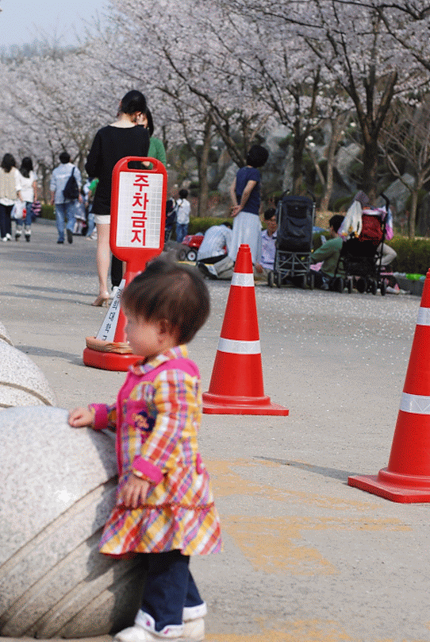
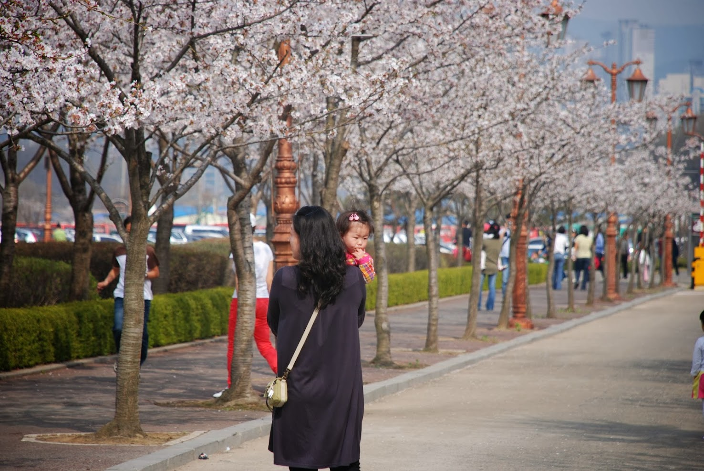

4월 11일 작년 이맘때처럼 벗꽃이 흐드러지게 핀날에 민혜엄마, 민혜와 경희대를 찾았습니다. 

그때만해도 아기바구니에서 잠만자던 우리 민혜가 어느틈에 이렇게 뛰어다니는 귀여운 아이가 되었습니다.

시간이 참 빠릅니다. 민혜 엄마 실험실의 도연선생님께서도 나오셔서 은서와 아름이도 보게 되었습니다. 🙂

안사람이 경희대에 있는한은 매년 벗꽃필때면 경희대에 오게 될 것 같습니다. 매년 그 자리에서 같은 모습으로 사진을 찍어볼 생각입니다.

p.s.

일본에 잠시 출장갔다왔습니다. 돌아온지는 일주일이 넘었습니다만, 출장을 돌아오자마자 넘쳐나는 일에 허덕대다가 이제사 글을 씁니다. 
