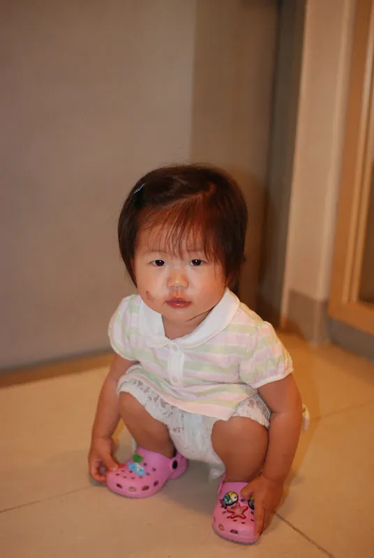
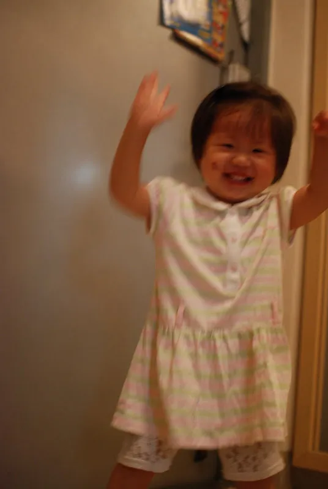

이상하게도 아빠가 민혜를 보기만 하면, 민혜가 다치는 경우가 많네요. 그것도 좀 크게..

안사람이 출장 가 있는 동안에는 그 동안 잘 놀던 욕조에서 놀다가 넘어져서 입술밑이 찢어지는 대형 사고가 나더니, 어제는 의자에 앉아서 뽀로로 보다가 제가 잠시 한눈 파는 사이에 의자에서 떨어져서 책상 모서리에 찍혔습니다. 우리 이쁜 애기 볼에 큰 상처가 났어요. 처음엔 광대뼈가 잘못된 것은 아닐까 걱정이 많았는데, 다행히 그정도는 아닌것 같습니다.&nbsp;

정말 착찹합니다. 애기 보는 것에 대해서 자신이 점점 없어지구요. 민혜한테 미안하기만 합니다.&nbsp;

소파에서 떨어지고, 욕조에서 넘어지고, 책상 모서리에 찍히고&#8230;아..정말 몇 번째인지 모르겠습니다. 저한테 큰 문제가 있는 것 같습니다. 주의력 부족일까요?&nbsp;

  이날은 7월 17일. 민혜가 처음으로 혼자 신을 신은 날..&nbsp;

  신을 꺼꾸로 신었어도 만세~

8월 15일 민혜는

<!-- summary 아래 한칸 공백 두어야함 -->
- 17개월 29일 (내일이면 18개월)
- 몸무게: 10.3Kg
- 키: 81.5cm

