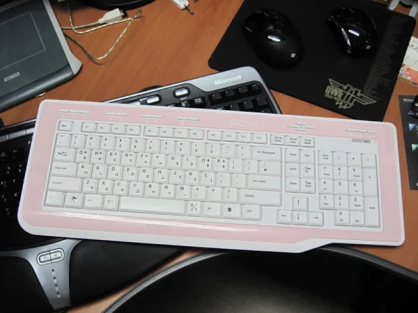
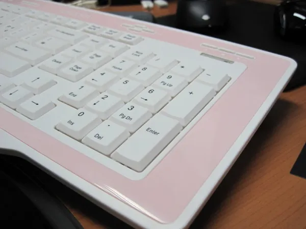
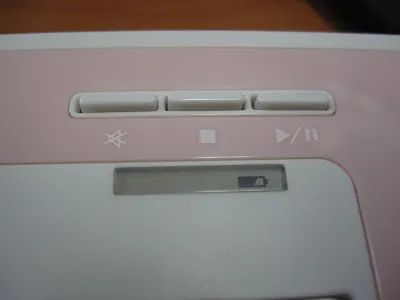
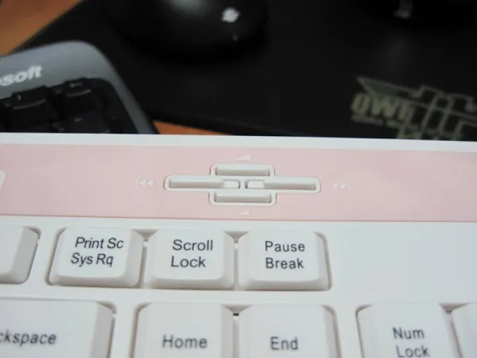
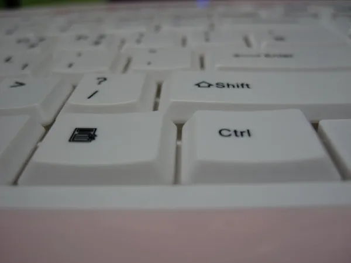

>          이 글은 <a href="http://compuzone.tistory.com/">컴퓨존 블로그</a>에서 있었던 필드 테스트 이벤트 결과로 작성된 글입니다. 그럴 일은 뭐 전혀 없지만, 혹시라도 너무 장점이 부각되었다고 생각하시는 분이 있다면 &#8216;필테의 결과로군&#8217;이라고 생각하셔도 됩니다.
 
나름 최대한 객관적으로 적었는데, 키보드라는 것이 워낙에 개인차가 있는 물건이라.. ^^;

babyworm은 입/출력 장치에 대한 성향이 좀 남다릅니다. 예전부터 컴퓨터는 약간 느리더라도 가장 오래 접하게 되는 human interface장비들인 키보드, 마우스, 모니터 들은 편해야 한다는 생각을 많이 가지고 있었지요.

특히 그 중에 키보드는 [예전에 적었던 글][1]에도 있지만, natural keyboard시리즈를 위주로 해서 상당히 많은 수를 사용해왔습니다. 물론, 내츄널 키보드라는 것이 워낙에 안나오는 물건이라 두손들고 일반키보드로 전향할까.. 하는 생각도 있습니다만.. 쉽지는 않네요.

여하튼, 키보드를 구입할 때 가장 힘든 점은 키보드라는 물건이 스펙과 디자인만 보고 살수 있는 물건은 아니라는 것이지요. 바로 키보드에서 가장 중요한 &#8220;키감&#8221;이라는 것에 대한 개인차가 존재한다는 것이지요.

게다가 키감이라는 부분도 MS 내츄럴 키보드와 같이 러버돔 방식을 취하면 시간이 지나면서 점점 키감이 무거워지는 특성이 있는 것도 있으니 설명하기 쉽지 않지요. (일례로, 집에서 주로 사용하는 MS natural keyboard pro의 경우 키의 무게감이 너무 강해져서 이젠 손가락이 힘들 지경입니다. )

잡설은 이쯤하고, ^^;

얼마 전에 [컴퓨존][2]에서 키보드 관련 필드 테스트가 있다고 해서, 게다가 핑크 색 무선 키보드라는 말에 혹 해서 신청을 했는데, 운좋게도 당첨이 되었습니다.

이 제품의 포인트인 색깔. 생각보다 연한 핑크색입니다. 보시는 분들 마다 &#8220;딸래미가 좋아할 색&#8221;이라 부를 정도의 색입니다. 약간 장난감 같은 느낌이 없잖아 있어서, 광고용 사진보다는 좀 싸보이는 조합입니다. 프라모델 느낌이 난다고 하면 적절할 듯. 그래도 이 정도면 키보드 자체의 형태는 가격대비 무난한 수준입니다.

크기는 생각보다 큽니다. 회사에서 사용하는 MS natural ergonomics 4000과 넓이가 비슷합니다.
요즘 슬림 키보드들이 외곽의 frame을 최대한 얇게 해서 작아보이도록 하는 전략을 사용하는데 반해, 이 키보드는 이쁜 핑크색으로 두르는 전략을 사용했기 때문이죠. 특히 팜래스트 부분이 되는 부분은 그냥 보기에는 약간 애매한 넓이로 보이지만, 책상에 올려두고 사용하면 바닥과 잘 어울려 아주 편한 자세를 만들어줍니다.

이 키보드를 처음 보시는 분들마다 오해(?)하는 부분인 전지 잔량 표시 부분.

처음 보면 e-ink 장치를 사용했나.. 하는 생각이 들게 합니다(원래 e-ink 장치는 전자책으로 사용되기 전에 아주 간단한 광고 혹은 표시 장치로 사용되었지요).

하지만, 자세히 보시면 그냥 배터리 부분만 투명창이 되어 있는 것이구요. 배터리 처음에 넣었을 때나 배터리가 부족할 때(이건 아직 경험해 보지 못했어요) 안에 있는 LED가 깜박거리게 됩니다. LED가 깜박이지 않는 것이 좋을 뻔 했어요. 게다가 휘도도 좀 줄이는 것이 좋을 것 같네요. 급싼티가 나서.. ^^;

키보드에서 가장 불만인 부분은 이 부분.

저처럼 손가락 큰 사람은 버튼 누를 때 그 주변의 버튼들의 감촉이 같이 옵니다. (즉, 바닥이 너무 약해서 그런것 같습니다. 다행히 같이 눌리지는 않더군요.) 익숙해지려면 시간이 좀 필요할 것이고, 습관적으로 버튼 누르다가는 잘못 눌릴 우려도 있습니다. 약간 사이를 띄어 주시는 것이 좋지 않을까 생각됩니다.

위에 나열되어 있는 멀티 펑션키들의 경우 공통적으로 사용되는 몇 개를 제외하면 그냥 그냥 1,2,3.. 과 같은 번호로 각인하는 것이 좀 더 세련되어 보이지 않았을까.. 하는 생각이 듭니다. 외람된 이야기 일 수 있습니다만. dicom 키보드는 외관은 이쁘게 잘 뽑아내는 반면에 레이블링을 어떻게 하면 좀 더 아름답고 세련되 보일까 하는 고민을 좀 더 하셔야 할 것 같습니다.

이번의 경우 전작의 DOK-101에서 스페이스 바에 회사명을 각인하는 만행 수준에 비하면 천만배 정도는 개선된 것이지만(핑크색에 흰색 각인이라 그럴 수도 있습니다만.), 좀 더 고민할 필요는 있어 보입니다. 아름다운 외관을 많이 망치거든요.

키감을 설명하기 전에 키 피치는 사진과 같이 아주 얕습니다. 저는 개인적으로 약간 깊고 부드러운 키감을 좋아한다고 전제하고 설명드리겠습니다.

일단, 키감이 생각보다는 나쁘지는 않습니다. (일단 깔고.. ^^;) 의외로 키에 반발력도 상당히 있는 편입니다(뜯어보지는 않았지만, 러버돔 방식으로 추정됩니다. – 추가 : 다나와 상품정보가 있어서 봤더니 러버돔 타입 맴브레인이 맞군요).

키 피치를 생각해보아 깊은 형태(마소에서 많이 사용하는)가 아니겠지요. 따라서, 키감이 얕고 좀 묵직한 느낌을 줍니다(묵직한 느낌이 슬림키보드에서 기대했던, 혹은 노트북에서 기대했던 경쾌함을 기대해서 나온 말이지, 실질적으로는 그다지 묵직한 건 아니에요). 이에 반해서 키를 지지해 주는 부분이 좀 불안정해서 그런지 모르겠는데, 비교적 키에 손을 대는 순간에 나는 소리가 좀 가볍게 들립니다.

그래서, 느낌상으로는 가벼운 소리 + (소리 대비) 묵직한 키감 이랄까요. 개인적으로는 처음에 좀 혼란스러운 키감이었습니다.

하지만, 앞에서 언급했듯이 키감 자체는 그리 나쁜 편은 아닙니다. (워낙 개인차가 심한 부분이라 조심스러운 부분이기도 합니다.) 개인적으로는 뭐 이 가격에 이정도면.. 수준이랄까요? ^^;

대충 해야 할 말은 다 한 것 같습니다.

외관에 있어서는 조금 싸 보이는 느낌을 지울 수 없습니다만, 핑크색 배색이 아주 화사하고 좋습니다. 21개월 된 우리 딸이 보고 처음 한 말이 &#8220;핑크색 키보드. 민혜꺼&#8221; 입니다. 집에 딸래미가 있다면 아주 좋아할 디자인입니다. (아마 중학교 이하라면 아주 좋아할 것이 확실합니다. ^^; 제가 이 키보드 쓰고 있는 것을 보면 딸래미가 달려와서 &#8220;아빠 민혜 키보드 주씨요~ &#8221; 하고 이야기를 합니다. 아마도 딸래미가 조금 더 크면 속절없이 빼앗길 듯..)

키감에 있어서는 이 정도면 가격대비 훌륭하다. 게다가 책상위에서 사용할 것이라면 손도 편하다고 말할 수 있습니다. 하지만, 무선 키보드의 특성상 무릎위에서 타이핑(엇.. 저만 그런 건가요?)해야 하는 경우에는 손의 위치가 참 애매해집니다. 이때는 약간 큰 팜 래스트를 지닌 키보드들이 좋겠습니다.(하지만 내츄럴 계통을 제외한 대부분의 키보드가 팜래스를 가지지 않은 상황에서 이건 무리한 요구라는 거.. 저도 압니다. ㅋㅋ)

이외의 참고 사항

1. 2.4GHz 대역의 무선 제품이 공통적으로 가지고 있는 문제가 하나 있지요. 바로 무선 랜 장비와 같이 사용할 때 아주 가끔이지만 버벅거릴 때가 있다는 것입니다. 이건 제가 사용하는 MS 무선 마우스들에서도 공통적으로 발생하는 문제이지요. 하지만, 키보드의 경우 비교적 마우스에 비하면 전송하는 데이터 량이나 신속성 같은데서 떨어지는 특성이 있어서 느끼기 쉽지 않습니다. 실제로 저는 한번도 못 느껴 보았는데, 다나와에 보니 이런 버벅거림을 느끼셨던 분도 계시더군요.
 
이쪽 대역을 사용하는 장비들의 공통 특성이니 단점이라기 보다 구매하실 때 &#8220;참고사항&#8221;정도로 생각하시면 됩니다.

2. 다나와 사진을 보니, 사진상으로 핑크색이 약간 진하게 나왔는데, 제가 받은 것은 훨씬 연해요..

3. MS 키보드에도 가끔 있는 배치이기는 하지만, 저는 그다지 좋아하지 않는 del, insert키 그룹의 이열 배치.

4. 크지도 작지도 않은 무선 수신기. 딱 MS bluetrack 5000 마우스 수신기 만해요.

아.. 마지막으로 가장 중요한 말을 잊을 뻔 했네요. ^^;

좋은 이벤트 마련해 주신 컴퓨존 분들 감사드립니다. 새로운 물건을 만지고 적응하고 글을 쓰는 것이 즐거운 시간이었어요.

진짜 마지막으로, 비트옹~ 땡스요~ 🙂

 [1]: http://babyworm.net/tatter/103
 [2]: http://www.compuzone.co.kr
