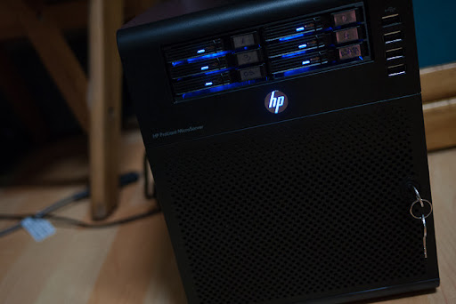

HP microserver는 요즘 나름 data holic들을 강타하고 있는 서버죠.

일단 강점은 HP가 만들었다는 점과 AMD의 저전력 processor(AMD Athlon II 모델 NEO N36L)를 채택해서 기본 구동에 소모되는 전력이 30W 수준이란 점입니다.

그야말로 개인/SOHO용 NAS를 타겟으로 하고 있는 서버라 할 수 있는데요.

Windows server2008을 지원(당연히 XP도 된다고 하더군요..하지만, 일단 서버급에서는 2008을)NAS에서는 불가능하다고 생각되는 여러가지의 것들을 구현할 수 있다는 장점이 있습니다.

대표적으로 Air video와 Aircomix 서버겠지요. 사실 이런류의 서버가 별로 프로세싱 파워를 많이 소모하는 것은 아닌데(따라서 더욱 저전력의 ATOM기반의 서버를 생각하실지도 모르겠는데..), air video의 경우 transcoding을 하는 경우가 있는데(play with live conversion을 사용하는 경우), 이때 프로세싱 파워가 솔찮히 먹습니다.

게다가 점차 쌓여만 가는 사진과 비디오 백업을 위해서 NAS를 살려고 헀었는데.. 뭐.. 약간 더 비싸지만.. 괜찮은 가격대이고요..

마지막으로 이 page가 cafe24 hosting인데 가끔 사진을 몇개 걸면 바로 전송량 부족이 걸립니다. (예전에는 자주 사진 – 일종의 짤방이었지만.. – 을 걸었다가 요즘에는 자제하고 있는 가장 큰 이유이기도 하죠..)

그래서, 겸사 겸사 호스팅 이사 계획을 세우고 있는 것이죠.

사실 거의 1995년부터 서버 운영질과 기타 등등을 해왔던지라 unix와 linux로 서버를 만들어봤지만, 윈도우는 크게 한번 데인 이후로 왠만하면 안쓰는데.. (아.. 이전회사에서 wiki server만들때 APM설정 귀찮아서 windows를 쓴 적이 있군요.. 그때도 auto backup거는 것이 참 귀찮았는데..)

이번에 웹 메트릭스는 한번 깔아볼까 생각중입니다. ( http://www.microsoft.com/web/webmatrix/ )

이런 저런 opensource 툴의 조합이긴 한데 나름 좋은 것 같구요..

일단, 요즘에 제가 뭔가 설정하는 것도 귀찮고..회사에서 사용하는 confluence wiki를 깔려고 했더니 cafe24는 그정도의 지원을 안해주고 (젠장..), crontab도 못쓰게 하고.. (얼쑤..)

아주 아주 길게 썼지만..결론은..

지를신의 강림 상황을 마치 커다란 논리에 의해서 움직이는 것처럼 자기 자신을 합리화시키려는 마음의 소리였다.

그래서 아마 마누라님 몰래 질러놓을 것 같다는거.. (설날 덕분(?)에 배송이 오래 걸린다니.. 그 동안 마음을 추스릴지도.. ㅋㅋ)

p.s. 
질렀습니다. microserver.. 
아직은 셋팅중입니다.

