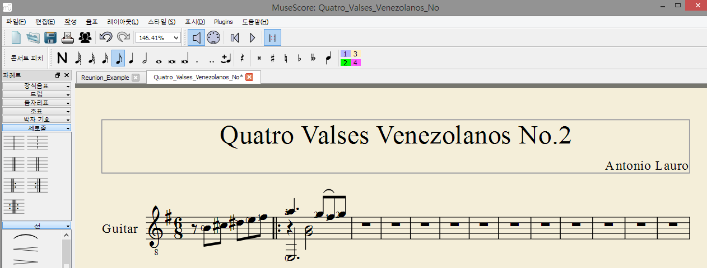
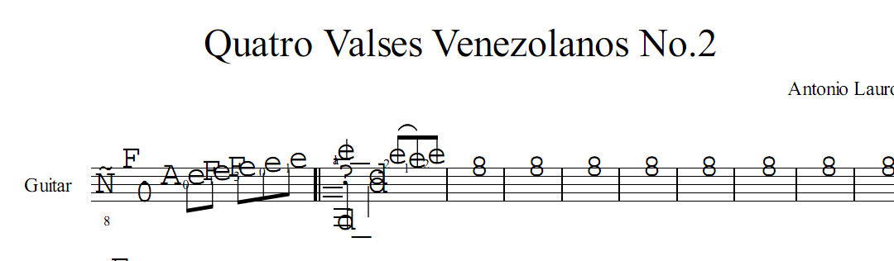
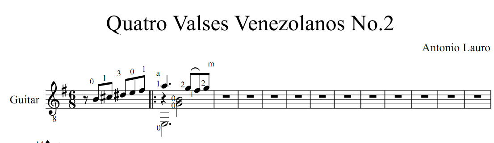

 

 

잠시 잉여로운 연휴라서 한번 설치해본 [MuseScore][1].

아래는 [MuseScore][1] 사이트에 있는 설명.

> _MuseScore(뮤즈스코어)_ 는 무료 크로스-플랫폼 WYSIWYG 악보작성 프로그램입니다. 경제적이면서 Sibelius(시벨리우스) 나 Finale (피날레) 같은 전문가용 프로그램의 대안으로도 손색없으며, 깨끗하고 정확한 악보를 인쇄할 수 있고, PDF 파일 및 MIDI 파일로 저장할수 있습니다.

그동안 사용했던 것은 90년대 초반에는 거의 Score. WISWYG 방식도 아니고 거의 언어와 버금가는 복잡함 때문에 나는 아주 간단한 것 이외에는 만들지 못했지만, 전북대의 Thilbong(이제는 아이디가 맞는지도 모르겠다.. Ketel 시절인지.. HiTel 시절인지도 가물..)님의 경우 예술적인 악보를 만들기로 유명했다.

그 이후에는 거의 encore를 이용했는데, Finale 보다 이쁘지는 않지만.. (결코 이쁘지 않다.. 아.. 이게 문제다.) 아주 편하게 악보를 찍을 수 있고, 비교적 운지기호 넣기도 편리해서 애용했더랬다.

그런데, MuseScore가 있다는 것을 알고난 후 한번 써봐야겠다고 마음만 먹고 있다가.. 이제야 써봤다.

아직 익숙하지 않아서 그렇겠지만,  현재까지의 얕고도 얕은 경험으로 기타 악보 입력에는 그냥 그렇다. 아직까지는  손이 너무 많이 간다.
보면 알겠지만, 이것 저것 테스트 한 후에, 제대로 입력해야지.. 마음 먹고 겨우 두 마디 입력했다..즉, 이 리뷰는 아직 참이 아닐 가능성이 농후하다.. 즉 다른 좋은 방법을 찾을 가능성이 있다는 말이다.
여하튼, 4개의 베네주엘라 왈츠 중 희안하게 2번만 없어서(아마 언젠가 한번 연주해보려고 악보를 꺼냈다가 잊어버렸겠지.. ) 입력하려 했는데.. 쩝.. 그냥 앙코르로 해야겠다.

(Encore의 가장 큰 장점은 직관적이고 편하다는 점이라, 별다른 교육 없이 악보를 찍어낼 수 있었는데 말이지.. 이건 적어도 그렇지는 않고 약간의 학습이 필요한가보다..)

첫 번째 문제는 악보를 구성하는 자유도가 떨어진다. (이건 아직 잘 안써봐서 그러리라..) 즉, 보표 사이의 간격을 필요에 따라서 조절해야 하는 경우가 있는데, 안된다.

두 번째 문제는 기본 설정 상으로는 운지 기호와 손가락 기호를 같이 표기할 때 거의 알아볼 수가 없다. 게다가 운지 기호를 입력할 때 운지기호를 반드시 음표 위로 Drag&Drop해야 하고, 이 후에 기호의 위치를 재조정해야 한다. 즉, 손이 두 번 간다.
어떤 음표에 따라 다니는지 명확히 표현할 수 있으니, 나중에 편집할 때 이런 저런 것을 안해도 될 것이라 위안을 삼지만.. 대부분의 경우 손가락 기호는 악보 입력후 가장 마지막에 입력하는 것이 일반적이라서..

<del>세 번째 문제는 PDF export하니, 악보가 깨진다. 아.. 이런..  왠지 이건 뭔가 방법이 있을 것이라 본다.. 설마.. 이 정도도 안될 것이라 생각되지는 않는다..</del>
이 부분 수정. PDF printer로 출력할때는 깨지고, Save As를 통해서 PDF로 저장하면 깨끗하게 나온다. (아래는 손가락 기호 부분의 위치도 열심히 한땀 한땀 수정한 버전..)

여하튼, 무료 프로그램중에서 이정도 퀄리티의 WISWYG editor가 생겼다는 것은 좋은 일이다.
일단은 좀 더 진득하니 써봐야지.. (솔직히 초반에 좀 짜증나지만, 익히는데 이 정도 짜증 정도야….)

다음엔 TeX 빠의 성향을 살려 MusicTex이나 써 볼 까나.. 왠지 Score 쓰는 느낌일듯..

 

 [1]: http://musescore.org/ko
