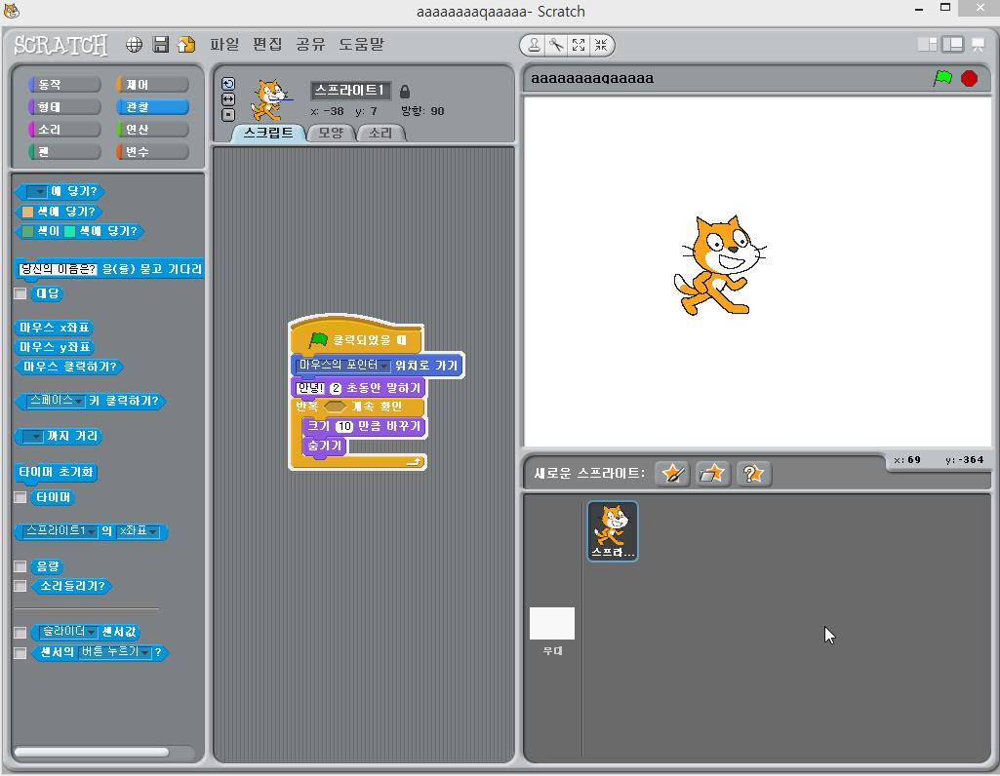
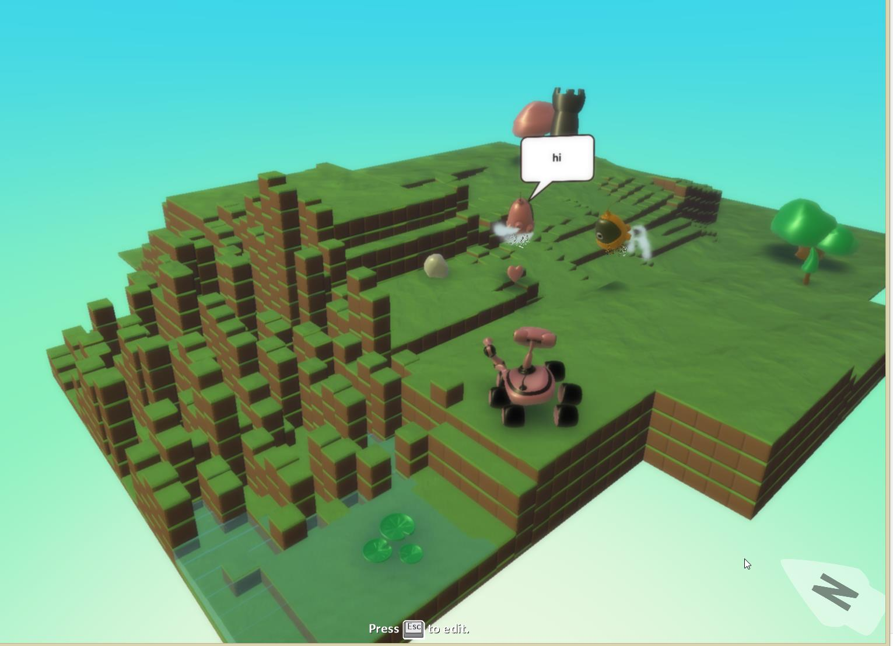

딸래미가 어느날인지 부터 게임제작자가 되고 싶다고 하면서 프로그래밍을 알려달라고 해서, 이것 저것 알아본 것이 [scratch][1] 와 [kodu game lab][2] 입니다.

## Scratch

Scratch의 경우 최근에 어린이들에게 프로그래밍을 가르켜주는 과정들에서 가장 많이 언급되는 visual programming 환경입니다. 비교적 한글화도 잘 되어있고, 이전의 예제들도 풍부한 편이죠. 목적 자체가 교육용으로 만들어진거라 비교적 프로그래밍의 제어도 명확하고, 각종 변수들을 조합할 수도 있습니다.

 

프로그래밍이라는 목적 자체를 위해서는 Scratch가 좀 더 명확합니다. (딸래미도 처음에 설명한 이후에는 별 설명이 없어도 이것 저것 해보고 있으니까요.. 아 물론, 아직은 가야 할 길이 멀지만요..) 논리를 키우는데도 도움이 될 것 같고요.

다른 장점으로는 스프라이트에 올라가는 object들을 직접그리고 추가할 수 있다는 점입니다.

 

딸래미가 이것 저것 그린 다음에 움직여 보는 것을 즐기거든요. 이것 저것 하면서 익숙해지더군요.

 

## Kodu gamelab
Kodu Gamelab의 경우 좀 더 직관적이지만, 제한적입니다. 요것이 뭔 소리냐하면, 제한된 캐릭터, 동작, 제어구조만 가질 수 있습니다.

하지만, 제한적인 만큼 게임하듯이 만들 수 있습니다. 아주 간단하게 이 케릭터는 어떤 경우에 뭐해라.. 정도를 간편하게 정해줄 수 있습니다.

장점은 아래 스크린샷을 보시면 알 수 있듯이, 오랜 시간 들이지 않고도 그럴듯한 모양을 만들 수 있습니다.  (프로그램 된 것은 핑크색 로봇 – 여기서는 Kodu라고 합니다.- 은 노란색을 따라가서 “Hi”라고 말하고, 노란색 Kodu는 핑크색을 보면 따라가도록 되어 있습니다.) 7살짜리가 잠깐 작업한건데, 그래도 왠지 그럴듯 해 보이죠?

Kodu의 가장 큰 단점은 아직 한글화가 안되어 있다는 점이고, 한동안 쉽지 않을 것 같다는 점입니다. Kodu gamelab 개발자들에게 한글화에 대해서 문의하고, 필요하면 번역해주겠다고 메일을 보냈는데, 이 부분이 Kodu의 기반이되는 XNA framework의 문제로 인해서 어렵답니다.

한글이 안되니, 딸래미가 혼자하는데 한계가 있다는 점이 가장 큰 문제군요.

일단 XNA4에서 하는 방법을 찾아보니, 방법이 없는 건 아닌 것 같습니다. 개발자와 다시 이야기를 좀 해봐야겠네요 🙂

 [1]: http://scratch.mit.edu/
 [2]: http://www.kodugamelab.com/
