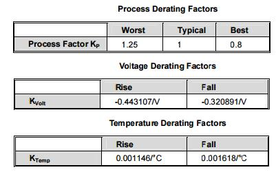

오늘 회사에서 이런 저런 이야기하다가, TSMC28HPC 공정에서 junction temp =0 보다 125에서 합성 속도가 빠르더라..는 이야기를 들었습니다.

이게 보통의 경우와는 차이가 있어서 ‘왜??’ 라는 생각이 들었고, 혹시 측정 잘못이 아닌지 싶어서 라이브러리의 SS HVT의 NLDM  lib 파일을 뒤졌는데 정말 그렇더군요.

지금까지 junction temp.가 높아지면 느려진다는 것이 제가 가지고 있던 상식이었거든요. (물론, 제가 공정쪽을 안해서 그냥 frontend engineer가 가진 상식선에서 말이죠..)

제 상식으로는 보통 process corner라 이야기하는 부분에서 process에서 doping 정도에 따라 N/P carrier mobility가 변해서 SS, TT, FF 같은 조건에 따라 성능이 바뀝니다. 이건 당연하죠. 당연히 mobility가 큰 경우가 빠릅니다.

공급 전압에서 따라 성능이 바뀐다는 것도 당연하죠. 전압이 높으면 빨라집니다.
참고로, 가끔 공급전압을 칩에 공급되는 전압으로 생각하시는 분들이 있는데, Cell로 들어가는 전압이죠. front-end만 하다보면 IR drop을 가끔 잊으시는데, power rail을 촘촘히 깔지 않으면 중간에 전압 강하가 너무 심해지죠. 물론, 이것도 동시에  천이되는 로직의 수에 따라 달라지니 backend engineer 분들이 고생하시는 거죠.

마지막으로 온도. 요게 문제인데 보통은 온도가 증가함에 따라 비저항(resistivity던가..)이 증가하면서 mobility가 낮아지게 되면서 속도가 느려집니다.

요기까지가 지금까지 제가 알고 있던 PVT (Process, Voltage, Temperature)  variation인데요.

그래서, 보통의 cell library의 databook(일단 구글에서 나오는 Verisilicon의 GSMC 공정을 보죠.. <https://www.google.co.kr/webhp?sourceid=chrome-instant&ion=1&espv=2&ie=UTF-8#q=verisilicon+GSMC+0.18)>에는 보통 아래와 같은 수식이 들어 있는 경우가 많습니다.

뭐 식은 다르지만, 보통 delay는 process의 derating factor, 전압 factor, 온도 factor의 함수라는 거고..

tP = Kp \* [ 1 + ( KVolt \* ∆Vdd ) ] \* [ 1 + ( KTemp \* ∆T ) ] * tp0

 

위의 식에서 아래와 같은 factor를 가지기 때문에 전압에 반비례, 온도에 비례하는 관계를 가지는 거죠.

즉, 이게 제가 보통 생각하는 factor인데요.

위에서 첫번째 이야기한 부분의 원인은 뭘까요?

바로 간과한게 하나 있는데, 사실 온도의 경우 조금 더 많은 부분에 영향을 준다는 거죠.

조금 더 많은 부분을 살펴보자면,

  1. 온도가 올라가면 비저항이 올라가니까 capacitance도 올라가겠죠.  그런데, 요건 cap을 충전시키는데 더 많은 전하가 필요하다는 의미가 되기 때문에 속도를 느리게 많드는데 기여합니다. (위의 것과 관계 없다는 이야기죠.)
  2. 온도가 올라가면 threshold voltage가 낮아지는 효과가 있습니다. 단 이 부분은 load cap, 원래의 Vth, slew rate에 따라 효과가 다르다고 합니다.
    ‘합니다.. ‘ 라고 앞의 부분은 들어서 알고 있었지만 사실 원인을 저도 잘 몰라서 그럽니다.  그냥 이해하는 바로는 온도가 올라가면서 excitation(여기.. 상태라고 했던거 같은데.. 뭐라 번역하죠? 흥분상태? ㅋㅋ 여튼,)상태로 갈 확률이 증가하고, 따라서 carrier가 gate를 뛰어넘을 확률이 높아지기 때문에 실질적으로 leakage도 늘어나고 vth도 실질적으로 낮아지는 것과 비슷한 효과가 있다고 ‘대충’ 이해하고 넘어갔었습니다.  뭐 digital 하는 사람이 이정도면 충분하죠.. ㅎㅎ

즉, 2번 부분의 효과가 증가하는 것이 아닌가 생각됩니다. 관련 부분에 대해서 일단 논문을 좀 읽고는 있는데, 음.. 쉽지 않네요. (그냥 current to voltage conversion 특성이 바뀌면서 오히려 느려지는 거야.. 라고 써있는 논문을 읽고 있는 바람에 ㅎ)

다른 걸 좀 더 찾아서 읽어보겠습니다만, 일단 DSM에서는 2번의 효과가 많이 커져서 mobility가 떨어지는 효과를 넘어서는 것이다.. 로 정리하고 있습니다. (혹 공정쪽에 계신 분 있다면 조언을..)

이전의 0.18um 정도까지는 이런 부분을 간단히 무시할 수 있었지만(사실 제 기억이 맞다면 90nm까지도.. ), 적어도 지금 확인헀던 TSMC28HPC HVT SS 라이브러리에서는 무시할 수 없다는 거네요.

여하튼, 중요한 사실은 “예전에 상식선으로 알고 있던 것이 지금은 사실이 아닐 수 있다”는 중요한 교훈을 얻었습니다. (더불어 예전 지식으로 먹고 살 생각하다는 큰일 날 수 있다는 교훈도…)

 

 

 