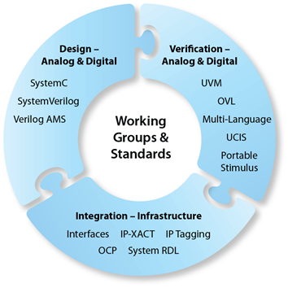
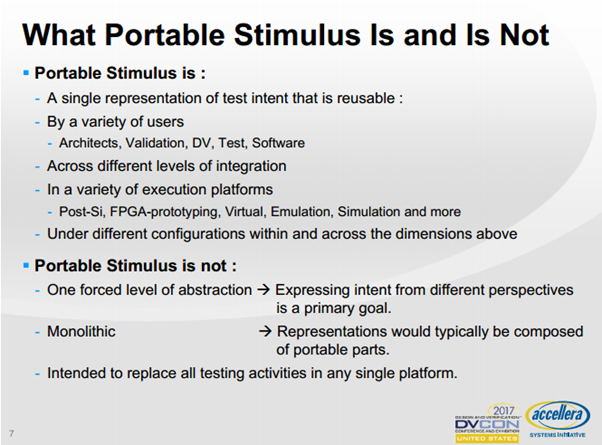
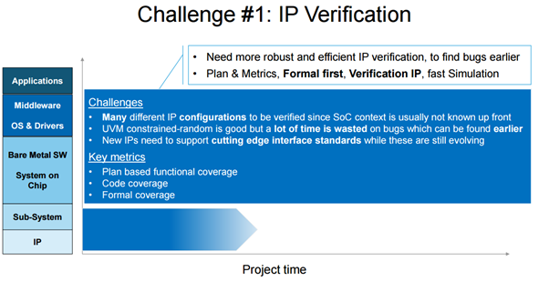

바로 밑에 DVCON 2016리뷰가 있는 걸 보니, blog에 얼마나 무관심했는지 약간 죄책감이 듭니다만 꺼리가 생겼으니 써야겠죠.

DVCON(Design & Verification Conference)은 산업계에서 주도해서 열고 있는 회의로, DVCON을 주최하고 있는 Accellra(<http://accellera.org/>)가 SystemC, VHDL, SystemVerilog, UVM, IP-XACT, UPF등의 굵직굵직한 산업계의 주요 표준을 만들고, IEEE-SA와의 협력을 통해서 국제 표준으로 등록하고 있는 단체라는 점을 고려하면 그 성격을 파악할 수 있을 것입니다.

<figure>
  
  <figcaption>현재 active한 Accellera 표준들</figcaption>
</figure>

사실 업계나 학계에서는 DAC나 ICCAD가 더 큰 이벤트라 할 수 있겠습니다만, 여기서는 학계의 연구 성과를 폭넓게 다루는 반면, DVCON은 산업계에서 지금 사용하게 될 표준에 대해서 다루고, 이걸 어떻게 효과적으로 적용해야 하는가에 집중하고 있다고 할 수 있어서, 실무에서 검증 다루는 엔지니어들이 바로 혹은 몇 년 내에 적용할 만한 기술들에 대해서 살펴보기에 가장 좋은 자리라 할 수 있겠습니다.

이번에 DVCON에서는 작년에 이어서 최근에 만들어지고 있는 Portable Stimulus Specification(PSS) 표준에 대해서 이야기가 많았습니다. 튜토리얼들에 이어서 패널 토론에서도 지속적으로 다루어지고 사용자의 피드백을 받고 있었습니다.

PSS의 출발은 비슷한 검증을 IP 수준, SoC 하드웨어 검증, 소프트웨어 수준에서 반복해서 하고 있으니, 하나의 언어 검증 의도(시나리오와 커버리지 목표)를 기술하면 이 의도에 부합되는 커버리지를 갖춘 소프트웨어와 하드웨어를 위한 검증/테스트 벡터(정확히는 테스트 케이스)들을 뽑아주겠다는 것입니다. 이렇게 하면 일단 아키텍처 단계에서부터 하드웨어, 소프트웨어 설계, 검증 단계로 가면서 관련된 검증 의도를 기술하게 되고, 요걸 다른 수준에서도 재사용하겠다는 겁니다. PSS는 (SystemC처럼) C++에서 구현될 수 있는 subset 처럼 정의되고 있는 중이며, action, object, resource등을 정의해서 각 모듈이 어떤 동작을 하고 어떻게 연결되는지 기술하는 방법을 쓰고 있습니다.

이때 주의할 건 검증 의도(verification intent)를 표현해서 공유하는 것이지 벡터 자체를 공유하는 게 아니라는 것이기 때문에 실제 동작을 만들어낼 트랜젝션에 대한 기술은 각 언어에 맞게 진행되는 것은 변함이 없다는 점입니다.

언어의 정의는 진행되고 있는데, portable stimulus라는 것 자체가 툴을 통해서 각 툴에 대한 의존성이 당연히 있기 때문에 아직은 실제로 정말 유용할 지에 대해서는 잘 모르겠습니다.

UVM의 경우 작년에 IEEE-1800.2로 표준화되면서 몇가지 변화가 있었는데, 변경된 걸 짧게 정리하자면, 다음과 같이 정리할 수 있겠습니다.

- 표준답지 않은 부분은 없애거나 정리했다.
- 불필요한 함수들은 통합되었다.
- Policy class가 대부분의 policy class들의 base가 되었고, factory 함수들 대부분이 이 class를 extend하고 있기 때문에 하나의 policy로 제어할 수 있게되었다.

이외에 몇몇 IEEE-SA와 Accellera의 역할이나 Accellera의 입장에서 고려하고 있는 것들을 이야기 했지만, 별로 중요한 것 같지는 않고요. 재미있는게 Go2UVM(<http://www.go2uvm.org/>) 이란 아주 간단한 툴에 대한 소개가 있었는데요. UVM이 복잡하다고 생각하는 하드웨어 엔지니어들이 쓸 수 있는 라이브러리(?), 유틸리티(?)라고 보면 될 것 같습니다.

테크니컬 세션에서 대해서는 몇몇 볼만한 것들만 이야기하겠습니다. (볼만한 것 많았습니다만… )

- Trends in Functional Verification: A 2016 Industry Study; 이젠 거의 매년 어떤 형식으로든 발표되고 있는 검증 관련 동향에 대한 발표입니다. (데이터는 매년 업데이트되는 게 아니지만..) 이미 많은 분들이 Verification Academy에서 이 내용을 읽으셨을 거라고 생각합니다.
  - https://blogs.mentor.com/verificationhorizons/blog/2017/01/03/conclusion-the-2016-wilson-research-group-functional-verification-study/

- 슬라이드가 벌써 올라와 있네요. https://dvcon.org/sites/dvcon.org/files/files/2017/50_1.pptx
- Keynote: Tomorrow’s Verification Today
  - 각 단계 별로 유효한 검증 방법을 설명했습니다. 예를 들어 IP 검증의 경우 앞으로 어떤 형태에서 검증될지 모르기 때문에 다양햔 configuration에서 검증해야 하며, 비교적 크기가 작아서 formal 먼저 하는게 좋답니다.
  - 여기서 나온 이야기가 아니라 formal 부분을 이야기하는 세션에서 나온 이야기입니다만, 겸사 겸사.. formal의 경우 속도 문제로 30K 이하에서는 pure formal을 사용하지만, 그 이상에서는 constraint에 대해서 회로를 풀어가는 방법(bug hunting)을 사용한답니다. 이때 constraint를 적절하게 적어주지 못하면 Corn of Influence가 너무 제한적이라서 검증이 안되는 부분이 생길 수 있는데 요걸 줄이기 위한 방법이 많이 이야기 되었습니다.
  - 

  - 반면에 SoC 검증에는 parallel simulation이나, emulation으로 다양한 시나리오를 검증하는 것이, Software bringup 단계에서는 emulation, FPGA prototyping이 중요하다는 이야기였죠.
  - 아마 검증도 deep learning을 사용하게 될 것이다 (verification hole을 찾고 coverage를 높이는 벡터를 만들기 위해서).. 라는 이야기를 했는데.. 요 내용이 이번 conference에서 나옵니다.
  - https://dvcon.org/sites/dvcon.org/files/files/2017/DVCon%202017%20keynote%20final2%2016×9.pdf
- Panel: SystemVerilog Jinxed Half My Career: Where Do We Go From Here?
  - 제목자체가 재미있는데요 (공감도 되고..) Verilog를 만든 Mooby를 비롯한 이쪽 분야의 Guru들이 모여서 이후에는 어떻게 될까 라는 주제로 이야기를 나누었습니다. Panel 중 한명이었던 Dave Rich(Verification Academy 포럼의 moderator이자 로봇이 아닐까 의심이 될 정도로 빠르게 답변을 달아주는 걸로도 유명하죠)의 글이 패널 토론의 앞부분 내용과 상당히 겹칩니다.
  - https://blogs.mentor.com/verificationhorizons/blog/2017/02/24/the-walking-lrm/

- 이번 Best paper는 Coverage Optimization에서 나왔습니다. (개인적으로도 가장 재미있게 보았습니다.)
  - 첫 번째 내용이 일정 단위로 시뮬레이션 check point를 잡고(시뮬레이터 기능이죠), 일정 단위동안 coverage가 올라가지 않으면 저장한 check point로 되돌아가 seed를 바꾼 후 다시 검증을 진행하고, 요걸 반복한다는 내용이었습니다. 이렇게 하면 하드웨어가 바뀐 경우(즉, coverage 측정을 다시해야 하는 경우) 짧은 시뮬레이션 타임으로 높은 coverage를 얻을 수 있다는 거죠. Seed를 바꾸는 건 누구나 하는 건데, 시뮬레이션 런을 다시 돌리는 게 아니라 checkpoint를 잡고 바꾸는 것이 특이하죠. 요 paper가 best paper 2등을 했습니다.
  - 두 번째는 조금 더 재미있는데, coverage를 찾아가는 것에 machine learning을 사용하자는 거죠. (앞의 formal 세션이나 keynote, 튜토리얼에서 이야기된 거죠.) regression을 반복하면서 분석해보면 테스트의 양(volume)과 이 테스트가 건드리는 bin들의 양(여기서는 breadth라 표기했습니다.), 그리고 특정 테스트에 의해서만 건드려지지는 bin들의 수(rarity)로 구분한 다음 요걸 Machine learning을 통해서 clustering으로 구분하는 거죠. 이렇게 되면, 서로 다른 test더라도 같은 그룹에 있는 테스트는 굳이 regression에 포함시킬 필요가 없어서 더 적은 테스트 벡터로 더 좋은 효과를 얻을 수 있다는 것입니다. 이 논문이 이번의 best paper였습니다.

아.. 잊을뻔 했는데, parallel simulation에 대해 Cadence(Rocketsim 기반의 Xcelium)와 Synopsys(VCS parallel)에 대해 서로 은근하게 까는 것도 재미있었는데요. 강도로 봤을 때 Xcelium이 조금 더 빠르지 않을까.. 하는 느낌이 들었습니다만, 느낌일 뿐이죠(근거 없습니다.). 서로 발표한 자료에 나온 speedup이 워낙 설계에 따라 달라서요.  DVCON 참가자들 사이에서도 ‘벤치마크 수치 서로 공개하지 못하게 하고 있는데, 그냥 Accellera에서 주도해서 공정하게 테스트하고 open하면 안되냐.. ‘라는 이야기도 나왔죠. (Parallel simulation 이야기하다가 나온건 아니지만요..)

그러고보니, 희안하게 PSS에 대한 이야기는 활발한 반면 HLS를 위한 SystemC에 대한 이야기는 별로 못들었습니다. 어찌된 일인지 모르겠는데요.. 제가 해당 세션에 들어가지 않아서 그런지도 모르겠네요. (그쪽에 들어간 분께 나중에 물어봐야 할 것 같습니다.)

참고로 DVCON은 친절하게 모든 논문과 자료를 1년 지나면 공개하고 있습니다. 아래 페이지에서 예전 자료들을 보시면 될 것 같습니다. https://dvcon.org/history (지금도 유효한 내용이 많으니 도움이 되실 거에요.)

올해 배운걸 어떻게 적용할 수 있을지도 고민이 되네요. (Formal은 이제 해볼만 할 것 같으니, 슬슬 evaluation해 봐야 할 것 같습니다. )

내년 DVCON도 기대되네요.

p.s. 요 글은 MS word로 써서 wordpress로 보내봤습니다. 예전에는 그림 삽입 문제가 있었는데, 이젠 잘되네요!