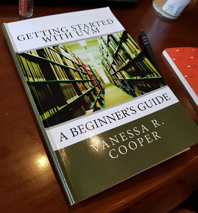

오랜만에 책 소개입니다.

<https://www.amazon.com/Getting-Started-UVM-Beginners-Guide/dp/0615819974>

지난 연휴때 읽어볼 요량으로 샀는데, 이곳 저곳 다니다가 이번 연휴 때 읽게 되었습니다. 특이하게 스타벅스에서 읽었네요. (음.. 제 생활 패턴으로 봤을 때 안 특이한건가.. 싶기도 하네요..)

이 책은 사진을 보시면 아시겠지만 엄청나게 얇습니다. 솔직하게 이야기하면, 받고나서 좀 아까웠습니다. (뭐 두꺼운게 좋은 책이란 말은 아닙니다만, 이렇게까지 얇으면 본전 생각이 살짝… 어흠 어흠)

얇은 만큼 미덕이 있습니다. 바로 금방 읽을 수 있다는 점이죠. (딸래미와 같이 스타벅스 2번 갔다오니 다 읽었더라… 정도로..)
다른 미덕은 아주 간단한 예제 하나로 [UVM][1]에서 사용되는 주요 구성요소를 한번 후루룩 보여준다는 점, 그리고 깊이 들어가지는 않지만 코드를 전반적으로 문단별로 설명해서 어떤 동작을 하는지 설명해 주는 점 역시 장점으로 생각하고 있습니다.

따라서, [SystemVerilog][2]는 대충 알지만, 내일부터 [UVM][1]을 써야 하는데 어디서부터 해야 할지 모르겠다는 생각이 든다면, 이 책이 시작점 정도는 될 수 있습니다.

단점은 중요한 개념들 중에 몇 가지가 좀 많이 빠져 있습니다. 사실 두께로 봤을 때 당연히 많은 내용이 생략될 수 밖에 없으며, 이런 것들은 나중에 reference manual을 보면 될 것으로 생각합니다. 다만, port/export 관계 같은 건 제대로 설명하는게 좋지 않았을까 싶습니다.

사실 책을 읽으면서 이것 저것에 대한 배경 지식이 없어도 내가 이걸 쉽게 이해할 수 있었을까… 라는 생각도 듭니다. 아마도 [Verilab][3]의 교육 프로그램의 교재로 사용되면서 강사가 중간 중간 개념을 설명해주는 경우라면 문제가 없을 것이지만, 아닌 경우에는 약간 혼란스러울 수 있었을 것 같습니다.

하지만, 대충 article 하나 정도의 두께(뒷 부분은 소스코드로 장수를 채운거라.. 실제 내용은 대충 70 page 남짓)로 대략적인 개념을 훓은 건 잘했다고 봅니다.

권장대상: [SystemVerilog][2]는 알지만 [UVM][1]은 처음이고, “내일”부터 뭔가 해 볼 예정인 사람.

비권장 대상: 논리적으로 이야기가 명확히 통해야하고, 중간 중간 설명이 생략된 상태에서 그냥 따라하라고 하면 화딱지가 나는 사람.

참고로, verilab에 가면 이 책에서 사용된 예제의 source를 받을 수 있네요. 참고하시면 될 것 같습니다.

 [1]: https://en.wikipedia.org/wiki/Universal_Verification_Methodology
 [2]: https://en.wikipedia.org/wiki/SystemVerilog
 [3]: http://www.verilab.com/