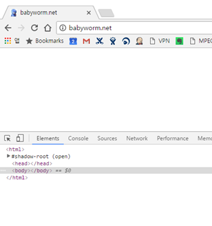

연휴인걸 귀신처럼 알고 사망하신 블로그를 살렸습니다.

제 문제는 blog를 들어갔을 때 아무런 내용도 나오지 않는 문제였습니다.

[코드를 봐도 참담합니다 ㅠㅠ]

같은 문제를 겪으신 분도 있을 테니 짧게 정리해 보겠습니다.

일단, index.php 를 확인해봤습니다. 혹시라도 연결이 잘못되었는지 확인해야 하니까 말이죠.

그 다음으로 DB를 확인해봤습니다. DB 손상이면(실수든, 해킹이든) 백업된 걸로 되돌려야 하니까요.
잠시 살펴보니 문제가 없어보여서 다음 단계로…

뭐 일단 DB가 살아있으면 데이터는 어떻게든 살릴수 있으니, 조금은 편안한 마음으로 일단 현재 디렉토리를 backup하고 수동으로 새 버전을 upload한 다음 DB update를 위해서 wp-admin/upgrade.php에 들어갔는데, DB가 벌써 upgrade되어 있더군요.

아마도 auto upgrade하다가 문제가 발생했을 것이라는 추측에 조금 더 무게가 실렸습니다.

wp-config 설정이 잘못되었는지 확인하고, wp-config에서 WP_DEBUG option을 켜고 돌려보았습니다.
제 경우는 wp-include에 있는 functions에서 문제가 있는 것 같더군요. [Google을 뒤져보니][1] 이런 메시지는 보통 plugin이 잘못되었을때 나타난다고 하더군요.

그래서, 일단 모든 plugin을 수동으로 disable 시켰습니다. 이 방법도 역시 [google검색을 통해서][2] 도움을 받았죠.
두 가지 방법이 나와있던데 저의 경우는 plugin 디렉토리에서 하나씩 디렉토리 명을 변경해서 disable 시켰습니다. (사용하는게 원래 몇개 없어서..)
음.. 제대로 되네요. 예상한 것처럼 plugin 문제가 맞습니다.

하나씩 켜보면서 보니, 결과적으로 몇몇 단어를 wikipedia에 연결해주는 wikipedia-autolink plugin이 너무 오래되어서 문제가 된 것 같습니다.

일단 요걸 꺼서 문제 해결이네요.

생각보다는 짧게 끝났네요.. 휴~

 [1]: https:/wordpress.org/search/add_option+was+called+with+an+argument+that+is+deprecated+since+version+2.3.0+with+no+alternative+available/?forums=1
 [2]: https://www.ostraining.com/blog/wordpress/disable-a-wordpress-plugin/