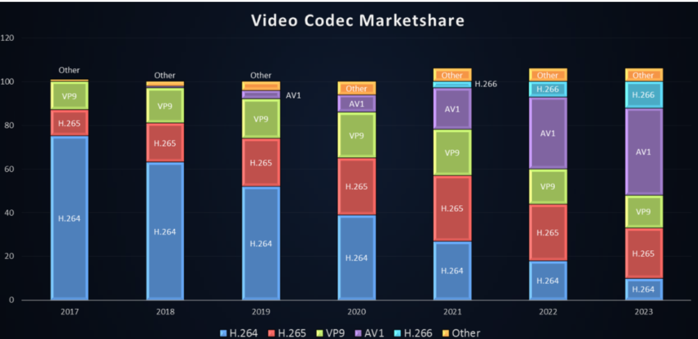

내용이 조금 자극적일 수 있겠습니다만.. 여하튼.. H.266/VVC의 최종안이 발표된 것이 2020년 7월이니, 이제 6개월 정도 지났습니다[^footnote1].
VVC는 과연 성공할 수 있을까요?

일단 성공이란 말을 조금 더 정확히 이야기할 필요가 있겠습니다. VVC는 당연히 나름의 지위를 확보할테니 말입니다. 다만, H.264/AVC가 그간 시장에 있던 다양한 코덱 표준들 중에서 독보적인 점유율을 확보하면서[^footnote2],  다른 코덱 표준을 사장시켰던 반면, 그 후광을 받은 H.265/HEVC는 기대에 훨씬 못미치는 점유율을 확보했으니 이걸 성공이라고 하기에는 애매하니까요.

H.265/HEVC의 문제는 요구 성능이나 압축 효율의 문제가 아니었다는 점은 비교적 명확해보입니다. 목표로 했던 subjective quality기준으로 2배의 효율성을 확보해냈고, 당시에는 복잡도가 너무 높은 것이 아닌가 생각했지만, 최근에 나오는 코덱에 비하면 뭐.. 비교하기 어려울 정도로 효율적이기 때문입니다. 실제 문제는 1) 효율 대비 비용의 증가와 더불어 이 비용에 대한 불확실성이 증가했다는 점과 2) 경쟁하는 무료 코덱이 발생했기 때문이라고 생각합니다.

우선 첫번째 부분 처리가 힘들어졌으니 뭐 장치에 비용과 시간이 투자되는 것은 그렇다고 해도, 특허에 대한 라이선스 요금에 대한 비용/불확실성 문제는 실제로 제대로 비지니스를 하려는 회사들에게는 큰 문제가 되었던 것입니다.
이전의 AVC와의 차이는 표준을 구성하는 특허들에 대한 라이선스 요금을 관리하는 patent pool의 형태의 차이와 목적에서 발생합니다. MPEG-LA에서 관리하던 AVC에 비해서, HEVC의 경우 MPEG-LA, HEVC-Advance(현재는 Access Advance), Velos Media, Technicolor까지 다양한 Patent Pool이 존재합니다 [^3].
즉, HEVC를 사용해서 사업을 하기 위해서는 각 Patent Pool에 대해서 각각의 정책에 따른 비용을 지불해야 한다는 점입니다. 이 부분이 기존 AVC와 비교하면 매우 비싸죠. (라이선스 요금을 내는 회사가 대부분 큰 기업체임을 고려하면 license fee의 cap이 가장 중요한데, cap이 아주 높습니다.).

초기에 HEVC의 성공을 확신하고 HEVC를 지원하는 하드웨어를 만들었다가 비지니스 조건에 따라 해당 하드웨어를 기계적으로 HEVC만 disable 시키는 방법등을 사용하는 경우도 발생하게 되었습니다. 물론 HEVC가 나온지도 이미 7년 정도되었으니, 하드웨어 단말의 경우 많은 경우에 HEVC가 보급되어 있습니다. 하지만, 여전히 streaming이나 기타 여러 사이트에서 HEVC format을 만나기는 쉽지 않습니다. 공중파나 위성 방송에서 UHD를 전송하기 위한 표준으로 HEVC를 채택했지만, set-top에서 확인하기 쉽지 않습니다.

과도한 라이선스 비용은 결과적으로 저렴한 비디오 코덱에 대한 요구를 가지게 되었고, 결과적으로 AOM(Alliance for Open Media)를 구성하고 그 첫번째 비디오 코덱인 AV1의 형태로 나타나게 되었는데, 이전과는 다르게 Youtube, Netflix[^4] Apple, Amazon, Facebook, Viemo, Cisco 등이 참여하고 있으며, 비디오 스트리밍용 솔루선 업체 다수가 참여하고 있으니 대다수의 streaming 업체가 참여하고 있으며, 참여한 업체가 아니지만, Twitch의 경우도 AVC이후에 AV1을 도입하기로 했으니[^5], 실제로 도입되는 경우에는 상당한 점유율을 가지게 될 것으로 생각합니다[^6].

Youtube에서는 AV1을 Youtube living room certification의 필수조건(2021년부터)으로 제시하면서 비교적 빠르게 저변을 확대해가고 있습니다. (물론, VP9은 google/youtube만의 코덱이라는 점이나, AV1의 경우 표준화된지 오래되지 않았으므로 단말의 수가 아주 많지 않은 상황이기는 합니다.)

물론, 로열티 문제가 적은 코덱에 AV1만 있는 건 아닙니다. MPEG에서는 MPEG-5 EVC를 만들었습니다. AVC 보다 좋은 효율을 보이는 baseline profile은 무료, HEVC보다 좋은 효율을 보이는 Main profile의 경우는 정해진 로얄티로 배포하는 전략을 가지는 것입니다. 또한, MPEG-5 part 2 LCEVC라는 부가 코덱도 있습니다[^7].

멀리 돌았는데, 요약하자면, HEVC가 크게 성공하지 못한 이유는 기술적인 문제라기보다 patent pool의 난립(실제로는 patent troll들이 들어오면서)으로 인한 과도하고 불확실한 라이선스 비용의 문제라 생각할 수 있습니다[^8].

이제 원래 이야기하기로 했던 VVC로 돌아와보죠. MPEG에서는 이 문제를 어떻게든 해결해 보려고 [MCIF](https://www.mc-if.org/") 같은 산업계의 단체를 조직해서 조정하려고 했지만 (ISO에서는 직접적인 조정이 불가능하므로), 생산 업체들의 참여보다 patent를 통한 이익 추구가 목적인 기관들이 이익을 포기하는 건 쉽지 않았을 것입니다. MPEG 의장이었던 Leonardo[^9] 역시 쉽지 않을 것이라 생각한 것 같습니다. Leonardo가 blog에 적은 글인 [A future without MPEG](https://www.linkedin.com/pulse/future-without-mpeg-leonardo-chiariglione/)이라는 글을 보면 이 부분이 잘나타납니다.

결국 오늘 발표에 의하면 MPEG-LA와 Access Advance로 나뉘게 되었습니다[^10]. 적어도 MCIF에 참여한 회사는 2개의 patent pool안에 들어갈 것이라 예측할 수 있는 정도가 장점일까.. 싶기는 합니다만, 크게 기대하지 않았기 때문에 그러려니.. 하는 생각입니다.

제 예상으로는 VVC와 HEVC의 상황이 아주 다를 것 같지는 않습니다. 즉, ISO/ITU-T 국제 표준이라는 위치는 여전히 공고할 것이므로 다양한 방송 표준에서 채택될 것으로 생각합니다. 따라서, 많은 TV, 휴대폰들에 탑재될 것이 예상되며, 표준 안정성이 중요시되는 CCTV등에서도 채택될 가능성이 높습니다. (아직 특허 풀들의 최종적인 정책이 정해지지 않았으므로, 예측하기는 어렵겠습니다만)

특별히 상황이 극적으로 바뀌지 않는 이상 video codec(특히 internet traffic 관점에서)에서 매우 큰 시장인 streaming의 경우 이후로도 VVC로 갈 것 같지는 않으며, AV1를 지나 AV2로 가지 않을까 싶습니다.

사실 VVC의 경우 이전 표준과는 다르게 decoder complexity 역시 &#8216;상당히&#8217; 높기 때문에[^11] 몇몇 실험에 의하면 AV1보다 높습니다. AV1이 그간 dav1d 와 같은 implementation을 통해서 많이 최적화되기도 했고요. 최적화까지 아직은 시간이 좀 필요할 것으로 보이며, 하드웨어 지원까지는 몇년 걸리곘죠. 다만, VVC enabled 장치가 많아진다고 해서 content도 많을 것이라 예상되지는 않네요.

아래 차트[^12]에 완전히 동의하는 건 아닙니다만(표도 좀 어설프고..), 대략 VP9의 비중이 더 줄고 H.264의 비중이 여전히 어느 정도 유지될 것이라는 부분을 제외하면 비슷하게 생각합니다. 사실 해상도가 낮을때는 크게 차이가 나지 않기 때문에, H.264가 유지될 확률이 높아보입니다.)

<figure>
  
  <figcaption>출처: Xilinx forum; video codec market share [1]</figcaption>
</figure>

이후에 다시 예전처럼 다양한 코덱 표준이 난립할 것이냐.. 하면 그건 또 아닐 것 같습니다. 대략 1) ISO/ITU-T 국제 표준 표준인 H.26x/MPEG 계통, 2) AOM의 AVx 계통, 3) 중국의 TV표준으로 사용되는 AVS 계통 정도가 남아서 역할을 할 것이라 생각되며, 방송, 산업 분야는 국제 표준 쪽이, streaming 부분은 AOM 계통이 가져갈 것으로 생각합니다.

이외에는 LCEVC 같이 base codec 위에 scaler나 super-resolution + residual을 이용하는 형태의 부가 코덱의 형식이 추가될 가능성은 있겠습니다만.. 대세가 될 것 같지는 않으며, 일부 분야에서 제한적으로 사용될 것으로 보입니다.

MCIF에서 나온 씁씁한 소식과&#8230; 내일 연차라 오랫만에 너무 긴 글을 썼네요. 🙂

[^footnote1]: 물론, NNVC(Neural Network based video codec) 기반으로 version2 혹은 차기 버전이 될 수 있는 내용을 JVET에서 실험 중이긴 하지만, 항상 version 1이 제일 중요하니까요.
[^footnote2]: 거의 20년이 지난 지금까지도 거의 압도적인 점유율 1위죠 (https://go.bitmovin.com/video-developer-report-2020 참조 )
[^3]: AVC, HEVC 모두 별도의 특허풀에 가입되어 있지 않은 회사는 제외하고 이야기해도.
[^4]: https://netflixtechblog.com/netflix-now-streaming-av1-on-android-d5264a515202
[^5]: https://www.youtube.com/watch?v=K1Fzm7nINjM&list=PLnRGhgZaGeBudITkCDPnGjnMSjK63bvSm&index=3
[^6]: 일부에서는 약간 억지스럽기는하지만, 이미 AV1을 도입한 Youtube나 Netflix의 점유율을 따져봤을때 이미 HEVC는 넘어섰다고 이야기하는 article도 있습니다.
[^7]: V-Nova라는 회사에서 개발한 것을 MPEG에 넣어서 표준화한 코덱입니다.
[^8]: https://www.streamingmedia.com/Articles/Post/Blog/HEVC-IP-Owners-Are-Killing-the-Golden-Goose-Over-Royalties-131923.aspx
[^9]: MPEG 의장에서 사임했으며, 이제 ISO/IEC JCT1/SC29/WG11-MPEG 역시 해체되었습니다. 물론, SC29밑에 WG2~WG8로 나뉘는 형태로 재편성하고, 그냥 통칭해서 MPEG이라는 이름으로 부르고 있습니다만..
[^10]: https://a7dce6fd-e8f0-45f7-b0b0-255c5c9a28e1.filesusr.com/ugd/0c1418_a055f01edeba4e0abe7a1c0482debab7.pdf
[^11]: https://arxiv.org/ftp/arxiv/papers/2012/2012.02832.pdf.
[^12]: 이 표는 xilinx forum에서 가져왔는데.. 음 link를 못찾겠네요

 [1]: https://i0.wp.com/babyworm.net/wordpress/wp-content/uploads/2021/01/image.png