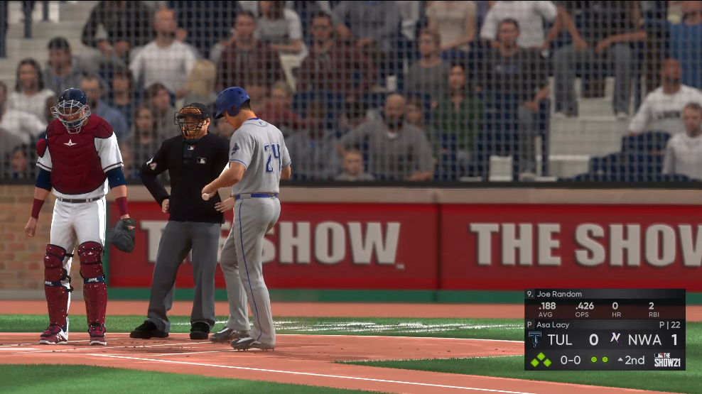

Cloud Gaming은 아주 예전(대략 10년전?)부터 뜰거라는 소문만 무성했었는데, 이제는 정말 될 것 같기도 합니다. 처음에 이 이야기를 들었을때는 video codec도 H.264 low latency 인코더 성능이 전반적으로 별로이기도 하고, 네트웍 latency 문제나 bandwidth문제도 심각한데다 3D 그래픽 성능이 지금보다는 훨씬 못미쳐서 그야말로 artificial scene을 만들어내서 비디오 코덱에 좋지 않은 그림이기도 해서 실제 사용은 제한적일 것으로 생각했는데요.

최근 들어서 모바일 네트웍이 3G에서 4G/LTE로, 이제 5G로 바뀌면서 killer app으로 cloud gaming을 잡고 있는 것으로 보입니다. 사실 4G의 가장 직접적인 수혜를 입은 것이 video streaming이라고 볼 수 있는데요. 이전에는 wired network을 대상으로 하던 수 많은 서비스들이 모바일로 가면서 시장이 폭발적으로 증가했다고 볼 수 있습니다.

5G의 가장 큰 특징이 latency의 감소이기 때문에, 가장 혜택을 볼 수 있는 것이 cloud gaming이라는 생각이죠. 물론, 네트웍 지연이 줄어들면서 혜택을 볼 수 있는 분야는 많습니다. 가장 크게 생각하고 있는 부분은 자동차에서 사용하는 통신 (V2X / V2V)인데, 이것도 5G의 low latency 특성에 힘을 받을 것으로 생각합니다. 다만, 안정성 문제때문에 edge에서 가장 중요한 부분이 처리될 것이고, 여기에 통신을 통한 정교한 인식이나 정보처리, 주변과의 통신을 이용하는 자율주행에 V2X/V2V를 사용할 것으로 생각됩니다. 현재로서는 V2X나 V2V는 인프라의 문제나 자동차에 들어가는 장치가 바뀌어야 하기 때문에, 변화하는데 시간이 걸릴 것으로 봅니다. (자동차가 바뀌는 시간을 생각하면 대략 15~20년 쯤? 기술적인 문제가 아니라 제도의 문제때문에..)

여하튼, 다시 클라우드 게이밍으로 돌어오면, 그래픽 카드 가격이 코인 덕분에 너무 비싸져서 high-end 게이밍 환경을 갖추는 비용이 너무 커진 부분도 있고, 프로세서들에서 비디오 코덱을 잘 지원하면서 low latency encoder들도 더 좋은 화질을 제공할 수 있고(하드웨어 코덱도 많이 퍼져있고..), 비교적 넓은 네트웍 bandwidth를 제공할 수 있는 네트웍 인프라도 깔려있고, 심지어 최근 몇년간 비디오 코덱 역시 video gaming을 성능 개선 목표로 두기도 했습니다. 일례로 HEVC의 경우 SCC profile에서 컴퓨터 화면을 효과적으로 보낼 수 있는 알고리즘들을 넣었지만, 실제로 대부분의 디코더는 main profile만 지원하기 때문에 크게 효과가 없었는데, AV1의 경우 main profile 수준에서 컴퓨터 화면을 잘 압축하기 위한 알고리즘들을 넣어놨기 때문에 AV1을 지원하는 장치에서는 cloud gaming 영상들을 더 잘 압축하게 될 것으로 봅니다.

이런 측면에서 최근에 국내에서 서비스를 시작한 <a rel="noreferrer noopener" href="http://Xbox Cloud Gaming" target="_blank">Microsoft Cloud Gaming beta</a>의 경우 놀랍습니다. 가장 놀라운 것이, 별도의 앱을 사용하는 것이 아니라 웹브라우져를 통해서도 클라우드 게이밍을 구현했기 때문입니다. 이 게이밍은 클라우드 상에 있는 XBOX Series X를 통해서 게임이 구동되고 1080p 60fps의 품질로 영상이 전송되어, 웹브라우저에서 보이도록 되어 있는 것이며, 게임의 조작은 게임 컨트롤러(xbox 패드나, PS dual shock, MS 게임 패드 등)를 통해서 하도록 되어 있습니다. 이전에 SKT에서 MS 클라우드 게이밍 앱을 안드로이드에서 서비스했었습니다. (지금도 MS의 파트너로 서비스 중입니다.) 다만, 당시에는 앱을 써야 했었는데, 이것 대신 브라우져를 통해서도 서비스를 시작한 거죠. 물론 앱에서는 게임 컨트롤러 없이 터치를 이용해도 가능한 게임들이 제공됩니다. (예를 들어 드래곤 퀘스트 11의 경우는 터치로 하기도 크게 무리가 없더군요)

웹을 통해서 제공되는 MS cloud gaming을 하려면 MS game pass가 필요한데, 어쩌다보니 game pass를 가지고 있어서 실제로 HALO라는 대표적인 FPS를 해봤습니다. 결론적으로 FPS도 할만하다는 생각입니다. 물론, 패드로 하는 것이니 마우스를 사용하는 FPS에 비하면 정확도가 그 자체로 떨어지기도 할테니 잘못 느끼는 부분도 있겠습니다. (latency와 FPS관련 논문을 보면 100ms 정도까지는 정밀도와 크게 관련이 없다는 결과가 있으니, 생각보다 일반적인 게이머는 그리 민감하지 않은 것이겠죠). 게임의 반응과 더불어, 화질도 생각보다는 매우 훌륭했습니다.

이외에 MLB The show21도 해봤는데, 오히려 여기서 약간 지연이 있다는게 느껴졌습니다 (워낙에 타이밍을 맞춰서 버튼을 눌러야 하는 경우가 많아서..). 다만 인간은 적응의 동물이라 아주 금방 적응하게 됩니다. 전반적으로 예상했던 것과는 다르게 매우 상당히 만족스러운 게이밍 경험이었습니다.

<figure>
  
  <figcaption>화질은 생각보다 놀라운 수준..이게 저지연 encoding이라니..</figcaption>
</figure>

인터넷 상의 이야기를 보면 웹브라우져를 이용한 클라우드 게이밍은 iOS를 지원하기 위한 묘책이라는 의견이 많은데, 안드로이드의 경우 앱의 형태로 베타를 진행했던 것이나, 애플의 불명확한 과금 정책등을 생각하면, 충분히 이해가 되네요.

웹브라우져로 이 정도 수준의 클라우드 게이밍이 구현된다면, 클라우드 게이밍이란 분야가 더 빨리 다가오지 않을까 생각됩니다.

 [1]: https://i0.wp.com/babyworm.net/wordpress/wp-content/uploads/2021/07/image.png
