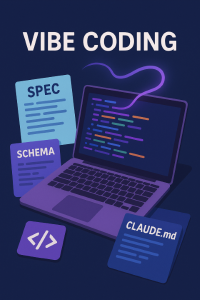

이건 frontmatter를 이용해서 써 보고 있습니다.

## Vibe Coding
최근에 Vibe Coding 이라는 것을 하고 있다고 이야기했습니다.

말이 참 거창한데, 몇 가지를 느낀 것이 있습니다.

- 내용에 대해서는 어느 정도만 적어도 잘 알아듣습니다. 왠만한 알고리즘은 "대충 알아서" 합니다.
- 형식이나 일관성을 지키려면, 정말 잘 모르는 junior에게 일을 시킨다는 생각으로 하나 하나 정확히 집어줘야 합니다.
- 내 이야기를 무서워하는지, 하다 안되면 꼼수를 씁니다. 내가 만들려는 부분의 인터페이스를 우회한다거나, 심지어 리포트를 조작하기도..
- 이상한 짓을 하려고 하면, 빠르게 ESC를 누르고 그런짓을 하면 안된다고 알려줘야 합니다.
- Claude Code의 경우 ctrl-T를 누르면 TODO list 볼 수 있습니다. 제가 해보니 항상 띄워두고 쓰는 게 좋더군요. (뭔짓을 하려는지 볼 수 있으니까요)

그런데, Claude Code와 Gemini에게 작업에 대해서 설명하다가 느낀건.. 내가 spec으로 design을 하고 있는 듯 한 느낌이 들었다는 겁니다.

## Spec. Driven Design
최근 이 용어가 뜨고 있더군요.

Github에서 Spec Kit (https://github.com/github/spec-kit)을 발표하면서, Spec-driven design, 소위 SDD라는 것을 이야기해서 그런것 같습니다.

사실 이건 저희팀에서 야금 야금 사용하고 있던 말이기도 했습니다. 제가 하고 있는 NOC 분야가 워낙 요구사항이 다양해서, 그때 그때 뭔가를 바꾸면서 대응하기 쉽지 않은지라, spec에서 code를 부분을 찾고 (물론, 전혀 없는 건 code를 짜야 하지만) 이걸 조합해서 toolkit 을 생성하는 방법을 사용하고 있는데, 이걸 specification driven이라 생각하고 있었습니다.

여하튼, Vibe coding의 practices를 모으면 SDD가 될 듯 하더군요.

실제로 작업 지침이라 할 수 있는 CLAUDE.md를 작성하고, 관련 문서들을 작성하고 import 시키고, 테스트 방법 잘 적어주고, 데이터 형식에 대해서 schema 적어주고..

이런 것 하다보면, 그냥 작업 툴이 바뀐 듯 한 느낌이었는데, 이걸 잘 표현한면 SDD가 되는 것이라 볼 수 있겠습니다. 한번 재미있게 볼만한 개념이 나온 것 같아서 좋네요.

AI가 너무 빠르게 바뀌고 있습니다. 정말 새 버전이 나올 때 마다 그 성능 향상에 놀라곤 합니다.
이제는 대부분의 기술회사에서 "전향적으로 검토해 봐야 할 때"가 되지 않았나 싶습니다.

