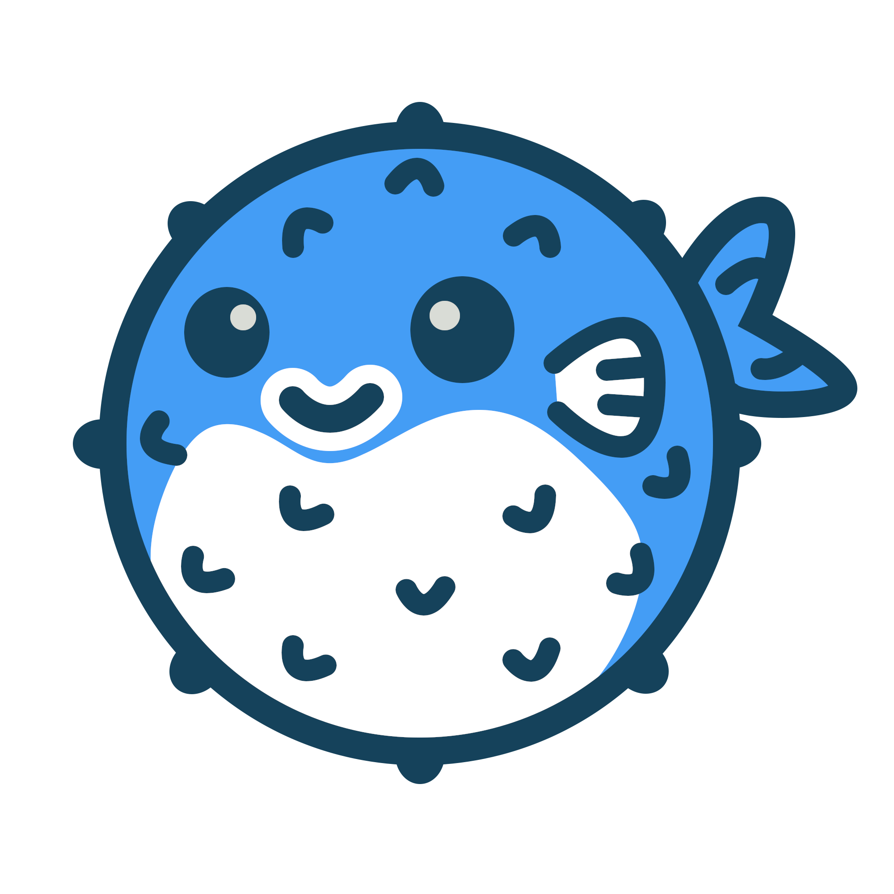

그간 미루고 미뤄왔던 blog 이전을 완료했습니다.

## 도메인 이전
제가 가진 도메인이 hostway을 통해서 진행되었는데, 몇년전 개인용 도메인을 지원하지 않게 되면서 콘솔도 사라지고 오로지 email로만 지원되는 상황..

`whois`로 보면 몇넌에 걸쳐 실제 도메인 관리는 아사달 -> 가비아로 넘어갔는데, 나는 hostway를 통해서 이메일로만 처리해야 하는 상황이었습니다.
게다가, https를 지원하지 않아서 수시로 막히기도 하고..

그래서 https 처리를 같이 할 수 있는 cloudflare로 도메인을 이동하기로 결정하고, 몇 가지 절차를 거쳐서 cloudflare로 이동했습니다. (무려 2주에 걸쳐)

## Blowfish
그간 github.io를 두고 Hugo + Jane으로 구성해 놓고 content를 옮겨서 테스트 중이었습니다.
 
그런데 막상 이걸 main으로 쓰려고 hugo와 Jane theme를 업데이트하고 나니, 에러도 나고, 고쳐도 바뀐 모양이 영 맘에 안들어서 급히 몇개의 theme를 뒤적였습니다.

그리고 선택한 것이 blowfish 로 바꿨습니다.

- https://blowfish.page/

Demo site를 보고 괜찮아 보여서 테스트삼아 설정했는데, 의외로 괜찮아서 결정했습니다.

이후에 기존 테마에서 customization 한 것들을 삭제하고, 기존 wordpress의 cache (Jetpack)에 걸려있는 사진들 이동하고.. (아직 한참 남았는데, 나중에 wordpress 사라지면 사라질테니.. 아직 많이 남았습니다.)

은근하게 귀찮은 것이 많습니다. textcube, tistory부터 약 20년간 converter와 converter를 거치면서 남은 잔재들..

틈틈히 보면서 눈에 띌때 마다 고칠 생각입니다.

## Customization

Blowfish에서 다양한 설정을 제공해서 문서 읽고, 이것 저것 바꾸는데 시간이 걸렸는데 몇가지는 customization 했습니다.

- article의 max width가 좁아서 늘리고
- 배경이 없는 경우에 hero 줄이고
- post의 target 바꾸고
- post에서 연도별, category별, Tag별 link만들고
- custom shortcode 추가하고
  - wikipedia, expand 등등

Deploy도 새로 추가했는데, cloudflare를 사용하는 김에 cloudflare page를 main deploy로 변경했습니다. Netify는 지울까 싶기는 한데, 나중에 visual editor를 추가할 가능성이 있을수 있어서 남겨두고 있습니다.

## TODO
그간 만든 article에서 내용 깨지는 것들 고치고, jetpack에 걸려있는 사진 옮기고, 링크 깨진것 복구하는 것들을 해야 할 것 같습니다.

생각보다 대 공사네요.

그래도, 대략 6~7개월 동안 생각만 하던 것을 모두 끝내니 좋습니다.
