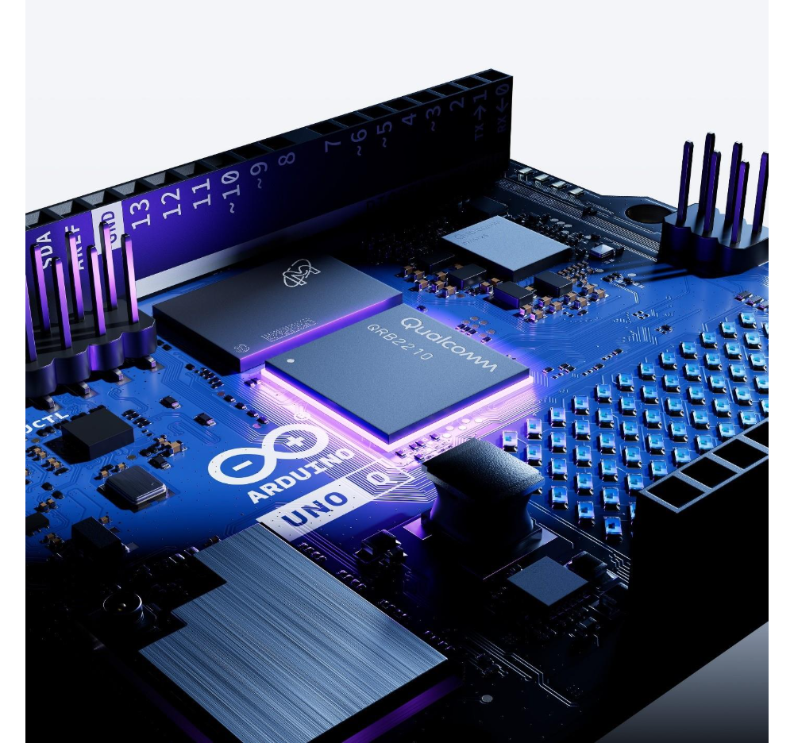
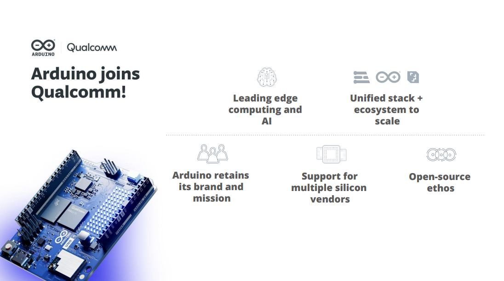

* [Qualcomm 보도자료](https://www.qualcomm.com/news/releases/2025/10/qualcomm-to-acquire-arduino-accelerating-developers--access-to-i)

추석기간 동안 에서 를 인수했다는 소식이 가장 중요한 이슈였습니다.

Qualcomm은 아두이노 UNO의 생태계(IDE와 다양한 shield를 의미하죠)와의 호환성을 유지하면서, 기존의 아두이노의 문제점이었던 scaling 문제를 해결할 수 있도록, RTOS, Linux, Python 등을 지원하겠다고 했습니다.

뭐, 당연히 Qualcomm의 Dragonwing이 붙어있는 [Uno-Q](https://www.arduino.cc/product-uno-q)도 같이 발표했습니다. (아두이노 페이지에서 preorder상태네요)

## 왜 의미가 있을까?
아두이노를 처음 접했을 때는 그냥  (이젠 이네요)의 ATmegaXXX이 붙어있는 evaluation board라고 생각했습니다. 하드웨어는 정말 별거 없는 거죠.

다만, 아두이노는 간편한 IDE(스케치)와 header 핀을 통해서 shield를 붙여서, 다양한 기능을 추가할 수 있도록 만들어져 있다는 점이 장점입니다.

다양한 3rd party에서 여러가지 형태의 shield를 지원해 줌으로써 생태계가 확장되었고, 사실 MCU 프로그래밍을 하는 사람들 보다는 media-art 쪽에서 더 많은 반향을 일으킨 것 같습니다 (언어도 그렇고요.).

이후에는 많은 사람들이 여러가지 간단한 prototype을 아두이노로 만들었습니다.

문제는 아두이노가 전형적인 bare matal 형식으로 프로그램을 올리는 거라, prototype에서 확장하려면 더 좋은 CPU를 사용하는 보드로 바꾸고, RTOS 위에서 움직여야 하고, 그 보드에 맞는 shield로 바꾸고, 프로그램을 바꿔야 하는 어려움이 있어왔다는 거죠.
(물론, 이런 문제때문에 몇몇 보드가 shield 수준에서 호환성을 제공하기는 합니다만, 프로그램을 바꿔야 하는 것은 피하기 어렵죠. 최신 버전의 아두이노도 지원하고요.)

이번에 이런 부분에 대한 개선이 이루어질 것이라 생각합니다.

## Arduino에 대한 추억
그냥 끝내기는 조금 아쉬워서..
 
아두이노를 접한 건 "CODE"의 번역을 마칠 때 였던것 같습니다.

이 책의 번역을 제안받았을 때는 회사일로 이런 저런 기판에 작업을 하고, 집에서도 취미로 만능기판이나 브레드보드에 뭔가를 만드는 것은 했었지만, 아두이노를 알고 있었던 상황은 아니었습니다.

당시 출판사 사장님께서 요즘에는 "아두이노"라는 게 유행이라고 말씀하셔서 보기 시작하고, Maker 잡지를 읽고 이런 것, 저런것을 만들어보기 시작하면서 아두이노를 사용하게 되었습니다.

이후에 "Make: Electronics"를 번역하게 되고, 겸사 겸사 여러가지 부품을 다양하게 구입하고 조금 더 본격적으로 재미있게(회로로 만들지 말고 아두이노 쓰면 이렇게 편할 걸..이라면서.) 만들어 보았습니다. 인사이트에서 Maker 시리즈의 역자/저자들과 회식(?)을 했을 때 이호민님이 아누이노 보드 기판 만들었다며 하나씩 나누어셨던 것도 기억에 남네요.

이제는 아두이노를 사용한 것은 상당히 오래되어서(라즈베리 파이만 써서), 잘 안쓰지만 말이죠.

몇개 가지고 있던 보드도 주변에 관심있는 사람들에게 나눠주기도 했고요.

하지만, 아두이노가 그 당시 거의 사라져가던 "전자회로 만들기"를 되살려서, 일종의 Maker 열풍을 일으키는데 중요한 역할을 한 것은 부인할 수 없는 것 같습니다.

역시 뭔가 한 시대가 끝나고, 새로운 시대가 만들어지는 느낌이군요.
